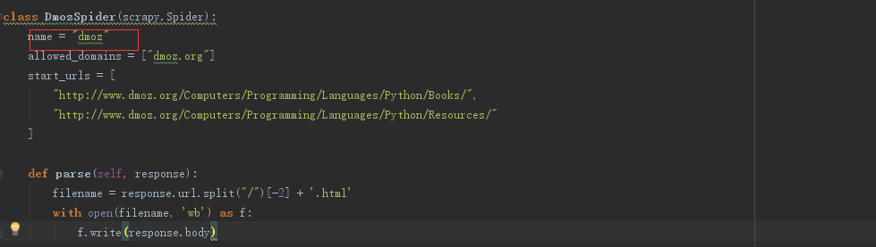

## 一、入门介绍爬虫Scrapy

## 二、scrapy介绍

## 三、起步

## 常见错误

#### 1. Windows下[scrapy写爬虫是出现no module named win32api错误](https://www.cnblogs.com/yrqiang/p/5295252.html)

windows下利用scrapy（python2.7）写爬虫，运行 scrapy crawl dmoz 命令时提示：

```python
exceptions.ImportError: No module named win32api
```

**解决办法**：安装pywin32

 Python是没有自带访问windows系统API的库的，需要下载。库的名称叫pywin32 。

介绍这个库里面最重要的两个模块：win32api和win32con。win32api顾名思义，就是用python对win32的本地api进行了封装；win32con个人理解为win32constant，即win32的常量定义。

有了以上这两个模块我们就可以来一个win32版本的Python Helloworld了。

```python
import win32api  
import win32con  
win32api.MessageBox(win32con.NULL, 'Python 你好！', '你好', win32con.MB_OK)  
```


#### 2.  另外一点就是需要注意一下爬虫的名字 如：dmoz，它是和以下这个名字对应的



 插个话题，这里还需要注意的是你需要到你所创建的爬虫项目目录下运行以上命令，比如你创建了 scrapy startproject tutorial 项目，你需要到tutorial目录下运行以上命令。

