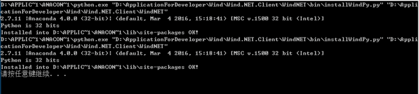

## 前言

在网上查了很多关于`virtualenv`和`conda`的信息，发现绝大多数都是讲述在`linux`下的部署，这也是愁煞了我这类金融狗了，`linux`没有wind资讯啊，如何是好？所以想专门写一篇小博客，讲述一下`virtualenv`和`conda`的区别和部署方式，并且以`windows 10`的环境为基础。同时也会考虑wind客户端的Python接口的问题。

我的系统环境如下：

- window 10 64bit
- anaconda2 32bit
- anaconda3 64bit
- wind的量化插件WindNet

首先用一句最简单的话去概括`virtualenv`，`pip`和`conda`的区别：

如果你过去使用`pip`和`virtualenv`,那么你可以用`conda`实现前两者所有的功能，`pip`是一个包管理器，`virtualenv`是一个环境管理器，而`conda`就是它们俩的综合体。具体的功能罗列以及相应的命令行请查看官网。（翻译自[conda官网](https://link.jianshu.com?t=https://conda.io/docs/_downloads/conda-pip-virtualenv-translator.html)）

pip机制非常好理解，下面我来简单阐述一下`virtualenv`和`conda`

## 一般情形下的virtualenv使用

**注意：请不要使用PowerShell去执行virtualenv命令，换成cmd去执行才可以。**

1. 首先`virtualenv`是一个`package`，需要安装

```bash
pip install virtualenv
```

1. 其次，需要到项目目录下生成一个虚拟环境

```bash
cd my_project_folder
virtualenv venv
```

输出以下结果：

```
New python executable in your_path\my_project_folder\venv\Scripts\python.exe
```

可以看到上面的第二句命令会创建一个包含`Python`可执行文件，以及`pip,setuptools,wheel`等一些和包安装相关的库。虚拟环境名称可写可不写(你可以直接输入`virtualenv`)，如果不写则会在当前目录，即`my_project_folder`下直接生成刚才讲到的文件。

1. 启动虚拟环境（注意请在`cmd`下启动虚拟环境，而不是 `PowerShell`）
    进入到`venv\Scripts\`目录下，直接在命令行内输入 `activate`即可启动虚拟环境。会在最左边出现一个`(venv)`的标注，表示已经进入到了`venv`的虚拟环境。

```bash
(venv) your_path\my_project_folder\howl\venv\Scripts>
```

此时如果你直接输入

```bash
pip install flask
```

则会在该虚拟环境下安装flask。

1. 运用虚拟环境
    在`my_project_folder`下的直接执行python文件就可以了。
2. 多Python环境下创建virtualenv
    笔者电脑里安装有anaconda2和anaconda3。virtualenv指令使用的是anaconda2下的命令，anaconda3下的virtualenv命令是被覆盖的，但是我们并不需要专门在修改virtualenv执行文件名去使用anaconda3下的virtualenv，只需要在创建虚拟环境的时候输入一个解释器路径即可，如下所示：

```bash
virtualenv -p D:/ApplicationForDeveloper\Anaconda3\python3.exe venv
```

1.  **关于WindPy**(主要针对金融狗而言）
    如果你的程序里面存在`from WindPy import w`，那么这个虚拟环境下运行改程序就会报错。

```python
Traceback (most recent call last):
  File "main.py", line 3, in <module>
    from WindPy import w
ImportError: No module named WindPy
```

这个问题，恐怕没法解决，因为`wind`的`Python`接口不是由`pip`安装的，在安装`python`插件的时候，程序自动查找该系统下的`python`环境，然后直接将`windPy`安装到这个环境下的`site-packages`下面。
 安装Wind的Python接口时，显示的日志是这样的：



很遗憾，这个是我们没法通过pip来控制的，但是可以通过继承的方式导入wind的Python插件，建立virtualenv的时候输入以下命令：

```bash
virtualenv --sytem-site-package venv
```

此外安装WindPy后，在cmd下运行python文件没有问题，但是在ipython里面运行就会报错:`ImportError: No module named WindPy`

## PyCharm下的virtualenv的使用

## conda使用

## PyCharm下的conda的使用
