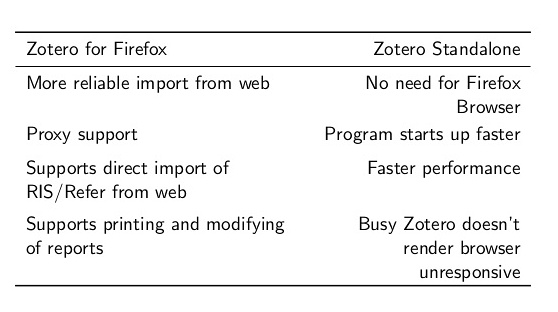
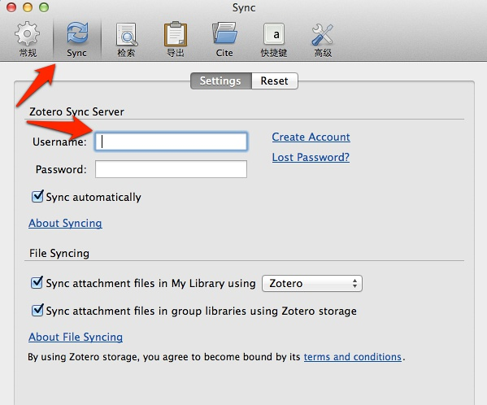
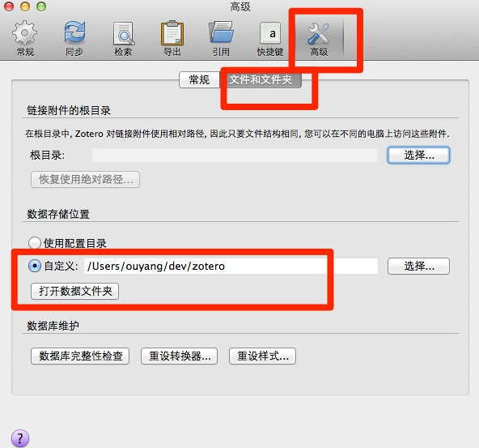
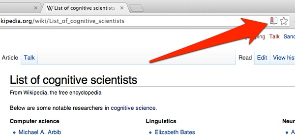
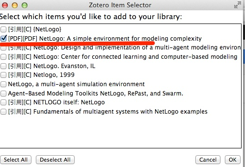
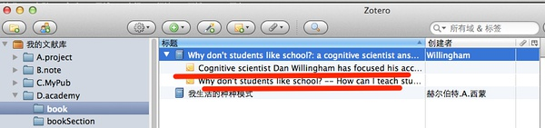
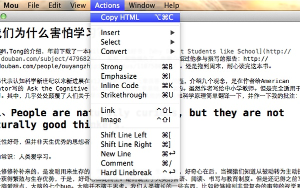
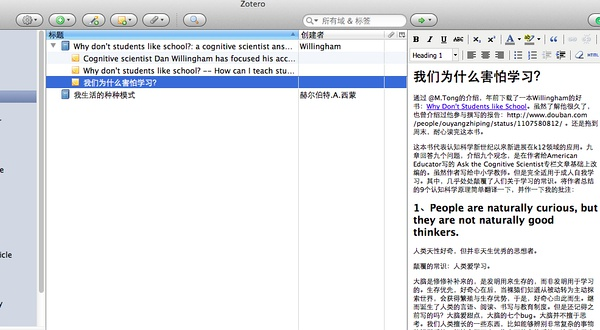
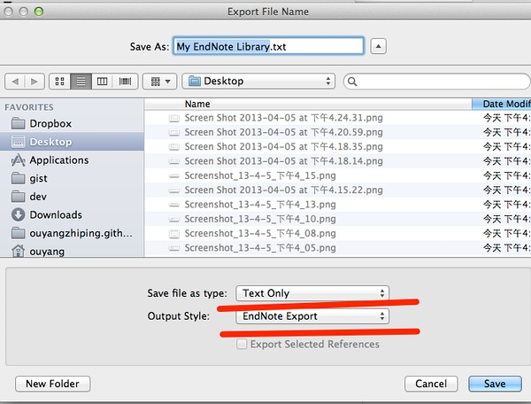
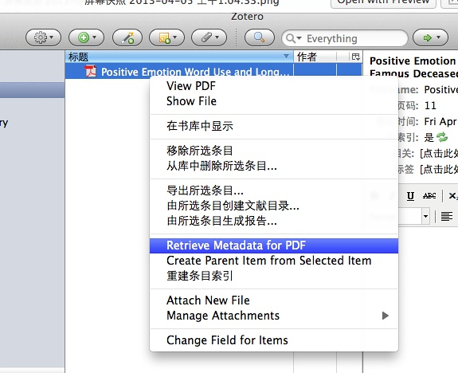

## 注册Zotero新账号并下载

登陆<https://www.zotero.org/user/register/>，注册一个自己的Zotero账号，请特别记住，username会直接生成个性域名，别乱起，未来会有些不方便。


下载Zotero单机版，也就是Zotero Standalone。Mac、Windows等通用。

http://www.zotero.org/download/

也可以下载firefox插件版，但是我更推荐单机版。两者的区别如下：



下载之后安装默认提示一路安装。

## Zotero版本介绍


## 配置Zotero

打开Zotero，找到[首选项]或偏好：


在同步一栏输入前面注册的账号，这样，文献库可以同步到[Zotero]官网。官方给我们提供了100MB的共享同步空间。当然基本不够用，后面会介绍如果用坚果云扩展。



创建一个用来保存文献库的根目录，假设是：/users/ouyang/dev/zotero 继续配置：



[Zotero]官网默认的存储空间有限，所以，我们需要一个小技巧，将文献库里面保存PDF文档的目录，分离开，放到[dropbox]目录下同步。回到刚才创建的：**/users/ouyang/dev/zotero** 目录，其中的**storage**目录是拿来保存PDF等文档的，将其剪切到[dropbox]目录下，如下图所示：


打开终端或shell，创建一个软连接，让[Zotero]认出该目录：

```bash
ln -s /users/ouyang/dropbox/zotero/storage /users/ouyang/dev/zotero/storage
```

回头看，**/users/ouyang/dev/zotero** 目录下多了一个软链接，表示成功了。


接下去，在配置这里安装pdf索引：


以及，将默认输出格式，更改为APA第六版：


## 导入第一篇文献

好了，准备工作做完了。现在，让我们导入第一篇文献。Zotero支持以下六种导入方法：

- 互联网自动识别：Web Translators (URL bar icon)
- 手动输入：Manual Input or Edit From a bibliographic
- 文件导入：format (RIS, BibTeX, MARC, etc.)
- 通过标示符增加：Add by identifier (DOI, ISBN, PMID)
- 通过PDF元数据识别：Add PDF then Retrieve Metadata
- 从网页识别：Get any Webpage with basic data

先让我们找找成就感，从最容易的开始。通过Web Translators，互联网自动识别。

打开豆瓣网站，随便找一本书，让我们以前一篇文章[心智十二宫]中的[我生活的种种模式]为例，它的豆瓣网页是：

http://book.douban.com/subject/1065156/

请特别注意，你的Chrome浏览器上会多出一个图书的标识！点击它，保存即可。


打开[Zotero]软件，我们会发现，之前鼠标定位的子类下面，会多出一个条目，如下图所示：


更有趣的是，[我生活的种种模式]这本书的豆瓣网址直接保存下来了，下次直接点击即可。这就是[Zotero]极其强大的Web Translators 功能，它可以根据世界上主要的信息资讯网站，生成相应的图标，比如，豆瓣的图书就是图书的小符号，维基百科则是维基类的小图标。更强大的是，一切你想保存资讯的网站，你可以定制Web Translators，然后保存在之前我们创建的根目录：

**/users/ouyang/dev/zotero** 下面的translators目录里面。如下图所示：


小提醒：如果没有多出这个图标，Web Translators 功能没有生效，是插件安装失误，请通过Chrome网上应用店，安装：[Zotero Connector](https://chrome.google.com/webstore/detail/zotero-connector/ekhagklcjbdpajgpjgmbionohlpdbjgc)。

## 导入维基百科

通过集体智慧的协作，目前[Zotero]软件的Web Translators已经几乎支持世界上主要高质量资讯网站，如维基百科、Google学术。现在，让我们继续找点成就感，自动导入维基百科试试看。

学习一门新学科，常常需要知道学科中的牛人，维基百科的列表功能就是非常强大的资讯源。我们打开它的认知科学家列表，基本代表了功成名就的认知科学家们：

http://en.wikipedia.org/wiki/List_of_cognitive_scientists

我们会发现，这次图标与保存豆瓣的图书图标不一样了！哈哈，变成一个百科全书的图标了，如下图所示：



我们仍然点击保存，好的，文献库就有了！


嗯？这次保存下来的为什么与上次的不太一样！多了个快照？点击看看！原来这是[Zotero]软件的另一个强大而贴心的功能，它自动将网页的快照拍摄下来了。这样，未来这个网页消失了，我们的资讯还没丢失！

## 导入Google学术

一次一次导入一篇，并不是学术研究时的常见现象。更常见的是，批量导入多篇。让我们以Google学术库为例。打开Google学术库，我们输入检索关键词，[netlogo]，一个网络仿真常用软件。

http://scholar.google.com/scholar?q=netlogo&btnG=&hl=zh-CN&as_sdt=0%2C5

我们发现，这次浏览器的图标变成一个文件夹！这就意味着，有多篇文献识别出来，需要保存。


点击文件夹图标，然后弹出对话窗口，我们挑选一篇引用率排第一、带PDF文档的保存下来：



打开[Zotero]软件，我们怒了！作为一个开源软件，它为什么能这么贴心！Google学术里面带PDF文档，刚才弹出窗口提示有PDF字眼的，它连关联PDF也关联起来了！如下图所示：


## 通过标示符增加

总有一些文献，google学术检索不出来（虽然，这个概率越来越低）。这个时候，需要我们手动添加。

让我们以前一篇文章[我们为什么害怕学习]为例，通过豆瓣，找到[Why Don’t Students like School]这本书的ISBN是：9780470591963。如下图所示：


我们启动[Zotero]软件，点击**通过标示符增加**的按钮：


输入ISBN：9780470591963。即可添加成功，如下图所示：



这次我们继续怒了！开源软件的贴心程度已经超出我们想象，这次保存下来的图书信息，多了什么呢！原来，多了两条笔记，来自出版商的介绍！

好的，接下去，我将我写的笔记保存进来。选中图书名字，点击右键：添加笔记。一般用户可以直接在这里写笔记。

如果是Markdown与Mou用户，则不要在这里直接写笔记，代码会额外混乱，点击**html**选项：


将Mou生成的html内容复制过去：



效果如下图所示，非常漂亮的笔记出来了！



小提醒：不过这么整理还是略微有些麻烦，笔者正在想办法，将[Zotero]与[Mou]、[Evernote]的配合更智能化。

## 导入Endnote数据库

好的，我们有大量的文献是使用其它文献管理软件管理的，怎么导入？以最流行、最常用的[Endnote]为例。选择File=>Export，如下图所示，记得一定要将导出风格选为：Endnote Export：



然后，导出的文本文件，直接导入到[Zotero]中即可，更复杂的导入方法，可以参考各类教程。

![26]./images/26.jpg)

## 导入PDF文档

有不少之前下载好的PDF文献，尤其是一些本来是从学术数据库下载的文献，它们支持PDF元数据功能，这样就非常省事，可以直接拖到[Zotero]中来，然后会自动将其文献信息识别出来。

如下图所示，我们将一个PDF文档拖到自己的项目文件夹中来，然后选择右键：[抓取PDF的元数据]，



就自动根据PDF元数据生成相关文献信息了：


## Zotero更多资源

Zotero还有更多进阶玩法，在这里不展开讲了。各位感兴趣的敬请查阅资料：

### 入门教程

- zotero中文快速入门：http://www.zotero.org/support/zh/quick_start_guide
- Zotero中文入门介绍：http://www.zotero.org/support/_media/zotero_miniguide.pdf
- 台湾中央研究院计算中心关于Zotero的介绍：http://ascc.sinica.edu.tw/iascc/articals.php?_section=2.4&_op=?articalID:3934
- MIT图书馆的教程：http://libguides.mit.edu/zotero
- Washington University St. Louis: http://libguides.wustl.edu/zotero
- Zotero入门介绍：http://www.slideshare.net/adam3smith/intro-zotero *[你为什么需要Zotero](http://www.slideshare.net/tjowens/zotero-workshop-slides)：其中关于六类人的漫画描述，极其生动。
- [研究生2.0关于Zotero的介绍](http://pulipuli.blogspot.jp/search/label/Zotero)
- [老杨与他本科同学写的Zotero介绍](http://blog.yesmryang.net/tags/Zotero/)

### 核心插件

- [Zotero插件大全](http://www.zotero.org/support/plugins)
- [zotero插件集合](https://addons.mozilla.org/en-US/firefox/collections/adverick/zotero/)
- [Papermachine](http://web.library.emory.edu/blog/supercharge-your-zotero-library-using-paper-machines-part-i)
- [Zotfile](http://www.columbia.edu/~jpl2136/zotfile.html)
- [Multi-Lingual Zotero](http://www.citationstylist.org/)
- [Qnotero](http://www.cogsci.nl/software/qnotero)
- [Translator testing](http://zotero-translator-tests.s3-website-us-east-1.amazonaws.com/)
- Zotero隐藏的偏好：http://www.zotero.org/support/preferences/hidden_preferences
- [RTF Scan](http://www.zotero.org/support/rtf_scan)

### 版式风格在线可视编辑

- [csl-editor](https://github.com/citation-style-editor/csl-editor)

### 整合工具

- [Omeka](https://github.com/omeka/Omeka) : Zotero开发学校的另一个项目
- [editorsnotes](https://github.com/editorsnotes/editorsnotes)
- Zotero开发机构的其他项目：http://chnm.gmu.edu/research-and-tools/

### 移动支持

- [ZotPad](https://github.com/mronkko/ZotPad)：iPad版的Zotero
- [zandy](https://github.com/ajlyon/zandy)：安卓版的Zotero
- [bibup](http://elearning.unifr.ch/bibup/tuto/index.php)：iphone版本的Zotero，更多参见：

<http://www.zotero.org/blog/zotero-apps-go-mobile/>

## 小结

与其说[Zotero]是一个文献管理软件，不如说是一个知识管理平台。选择开源软件，就是选择一个生态链，这是与商业软件，如[Papers2]、[mendeley]或[Endnote]非常不一样的地方。