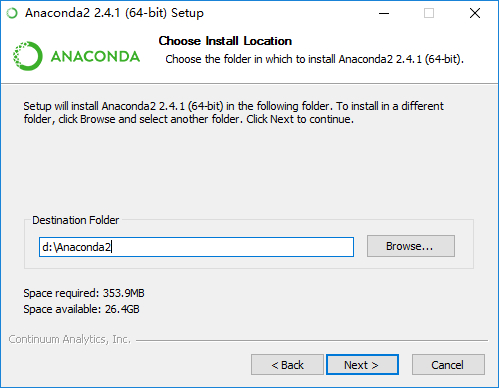

## 一、Anaconda介绍

**Anaconda**是一个Python的科学计算发行版，包含了超过300个流行的用于科学、数学、工程和数据分析的Python Packages。由于Python有2和3两个版本，因此Anaconda也在Python2和Python3的基础上推出了两个发行版，即**Anaconda2**和**Anaconda3**。

## 二、Anaconda版本
## 三、同时安装Anaconda2\3

### Windows下同时安装Anaconda2和Anaconda3

### *前言*

------

有时候我们会在电脑上同时使用Anaconda2和Anaconda3两个版本，因此有必要考虑它们的共存问题。一般的使用场景是以其中一个版本为主，另外一个版本为辅，因此只需要达到能方便的切换到备用版本，且备用版本的pip等命令能正常使用即可。

由于Anaconda2和Anaconda3包含较多的模块，很多人是不需要这些的，因此若只想要较为纯净的Python2和Python3共存的，可以看本文最后一部分。

### *操作步骤*

------

1. 首先安装**主版本**，在这里我们选择**Anaconda2**，按照正常步骤安装即可，这里假定安装目录为`D:\Anaconda2`。

   

2. 在这一步打上那两个勾。

   

   第一个选项是将安装目录加入到系统的PATH环境变量中，以后在CMD中便可以直接用python命令启动python。 
   第二个选项是让其他IDE能够检测到Anaconda2并将Anaconda2作为默认的Python 2.7。

3. 安装好Anaconda2之后，再安装Anaconda3，这里Anaconda3的安装目录必须选在**D:\Anaconda2\envs**子目录下，如图所示，最后的”py3”可以自己另取。

   

4. 这里取消掉那两个勾（按照字面意思理解，打上第二个勾应该是没有影响的。至于第一个选项，由于之前已经把Anaconda2添加到系统PATH路径下了，因此再把Anaconda3添加进去，由于顺序在Anaconda2的后面，几乎是没有作用的，所以这里没有勾上）。

   

5. 安装完成之后，在CMD里面直接输入`python`会启动**Python2**，而使用`activate py3`（**py3**即之前**Python3**安装目录文件夹的名字）命令之后，再使用`python`即可切换至**Python3**，如下图所示。使用`activate py3`命令之后，在命令行前面会出现一个`[py3]`标记，此时使用任何的`python`命令都是在**Python3**下进行的。使用`deactivate`命令可取消激活**Python3**。

   

### **纯净Python共存**

------

说是纯净，其实也不完全“纯净”，这里需要用到另外一个发行版**miniconda**，它仅包含Python本身和Conda包管理器，因此体积不大。使用**miniconda**时的共存安装方法与上述步骤完全一致，就不赘述了。

[miniconda下载主页](http://conda.pydata.org/miniconda.html)

### **总结**

------

本文的共存实现方法其实是基于**conda**的创建虚拟环境的功能，详情可见[此链接](http://conda.pydata.org/docs/using/envs.html)。

因此在首先安装主要版本之后，也可使用`conda create -n py3 python=3`命令来安装**Python3**，但由于网络问题，这种方法容易失败，所以自己先下载好完整安装包，然后安装到主版本主目录下的`envs`文件夹更方便。

有人也许会说直接同时安装**Anaconda2**和**Anaconda3**，然后将**Anaconda3**目录下的**python.exe**改为**python3.exe**也可实现类似的共存。但这种方法存在一个较大的缺陷，即**Anaconda3**内包含的某些IDE会工作不正常，如**Jupyter Notebook**和**Spyder**等，因为他们依赖于安装目录下的**python.exe**，且备用版本的`pip`等命令也没办法直接使用，总体来说很不方便。

很多的情况下使用python3的资源会比2多不少，比如说在xgboost包的安装问题上，python2需要用到GIT，编译器等，先下载源码再编译，然后添加路径，之后通过GIT调用python安装，还不一定成功。反观python3，网上有现成的.whl文件，下载下来pip一下就好，轻松又愉快。但是对于之前用惯了python2，并且有不少代码已经写在里边的同学，一时间要换成3也是有点困难，所以就需要同时使用python2和3了。我们需要的是基于某个版本的anaconda，2或者3都可以，下面以2为例。

首先需要我们设置一下anaconda，使用清华的镜像，原地址会非常慢。cmd中输入
```
conda config --add channels https://mirrors.tuna.tsinghua.edu.cn/anaconda/pkgs/free/
conda config --set show_channel_urls yes
```
这之后在你的c:\Users\用户名下的.condarc中就会多了我们添加的地址

只需要删掉defaults那一行，保存一下就设置成功了。

之后开始干正事，首先在cmd中写入命令 
```bash
conda update conda
```
用于更新anaconda，完成后
```bash
conda create --name python3 python=3.6
activate python3
```
相当于在conda目录的envs文件夹中创建了一个新的环境python3，并且通过activate命令激活了它，在activate命令后你的cmd前应该多了一个括号里面写着python3


然后在激活了的python3环境中安装anaconda的库
```bash
conda install anaconda
```
因为之前已经设置了镜像，如果你的网速不差的话应该一会就好了，完成之后欣喜的发现

所有东西都多了python3的版本，当然如果你习惯用notebook来debug的话同样可以参照之前的博客里提到的，给python3也设置一个自定义工作目录的notebook快捷方式。

然后就可以愉快的用它们喽，打开python3的notebook来看看是不是真的python3好了，输入
开心地看见

大功告成。


#### 更改pip源

### windows
在 c:\user\username\pip\pip.ini中加入
```
[global]
index-url=https://pypi.tuna.tsinghua.edu.cn/simple 
[install]  
trusted-host=pypi.tuna.tsinghua.edu.cn
disable-pip-version-check = true  
timeout = 6000 
```

>注意：首先需要创建pip文件夹与pip.ini文件。

#### linux（ubuntu）

同样首先建pip的配置文件

```bash
cd $HOME  
mkdir .pip  
cd .pip
sudo vim pip.conf  
```
在里面添加
```
[global]  
index-url=https://pypi.tuna.tsinghua.edu.cn/simple
[install]  
trusted-host=pypi.tuna.tsinghua.edu.cn 
disable-pip-version-check = true  
timeout = 6000 
```


#### 更改anaconda源
```bash
conda config --add channels https://mirrors.tuna.tsinghua.edu.cn/anaconda/pkgs/free/ # 不要有引号，网上有的帖子会在链接两端加引号，需要去掉。
conda config --set show_channel_urls yes
```
好了，这下可以开心的下载东西了

----


#### 如何删除添加的源呢？
```bash
conda config --remove channels https://mirrors.tuna.tsinghua.edu.cn/anaconda/pkgs/free/
```
#### 看看当前的 cofig 是什么样的
```bash
conda config --show
```
## 四、pip和conda有什么不一样？
既然都是关于python的包管理工具为什么有了pip 我们还需要conda？在stackoverflow上的英文回答：
>
> Having been involved in the python world for so long, we are all aware of pip, easy_install, and virtualenv, but these tools did not meet all of our specific requirements. The main problem is that they are focused around Python, neglecting non-Python library dependencies, such as HDF5, MKL, LLVM, etc., which do not have a setup.py in their source code and also do not install files into Python’s site-packages directory.
> So Conda is a packaging tool and installer that aims to do more than what pip does; handle library dependencies outside of the Python packages as well as the Python packages themselves. Conda also creates a virtual environment, like virtualenv does.
>
> As such, Conda should be compared to Buildout perhaps, another tool that lets you handle both Python and non-Python installation tasks.
>
> Because Conda introduces a new packaging format, you cannot use pip and Conda interchangeably;  pip cannot install the Conda package format. You can use the two tools side by side but they do not interoperate either.
>

> 在python的世界里也浸淫多年了，我们早已习惯有 pip ,easy_install 和virtualenv的世界，但是这些🔧没有解决我们所有的需求哦。这其中主要的问题是他们全部都集中解决关于python相关问题而忽略了非python库的依赖关系。(这句我没他看明白),就像 HDF5, MKL LLVM,etc等，在他们的源码中并没有setup.py这种东西而且也没有安装文件在python的site-packages 目录中。
>
> 所有conda就是一个包管理工具和安装工具，它就是要做比pip更多的事情；在python-site-packages之外管理python 库依赖关系。 而且conda同样也像virtualenv一样创建一个虚拟环境。
>
> conda可以让你同时管理安装处理你有关python的任务和跟python无关的任务
>
> conda使用了一个新的包格式，你不能交替使用pip 和conda。因为pip不能安装和解析conda的包格式。你可以使用两个工具 但是他们是不能交互的。
>

conda环境的常用启动命令
```bash
# 启动
source activate xxx

# 关闭
source deactivate

# 更新
conda env update -f environment.yml 更新配置文件
```