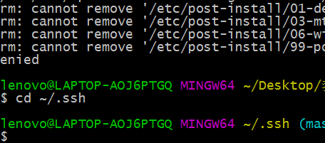
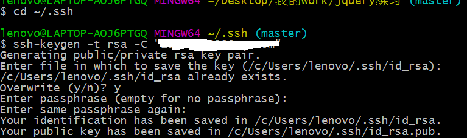
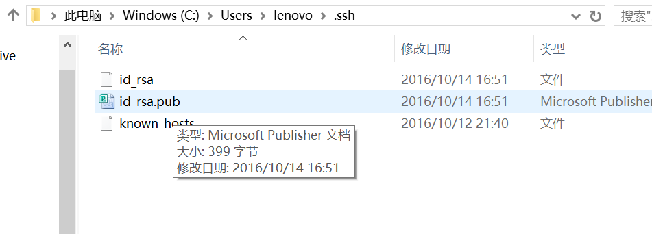
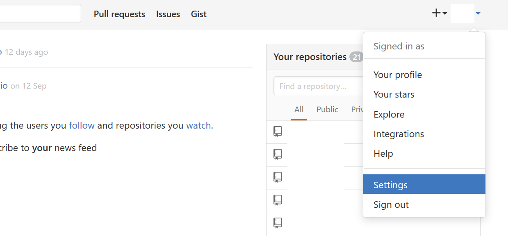
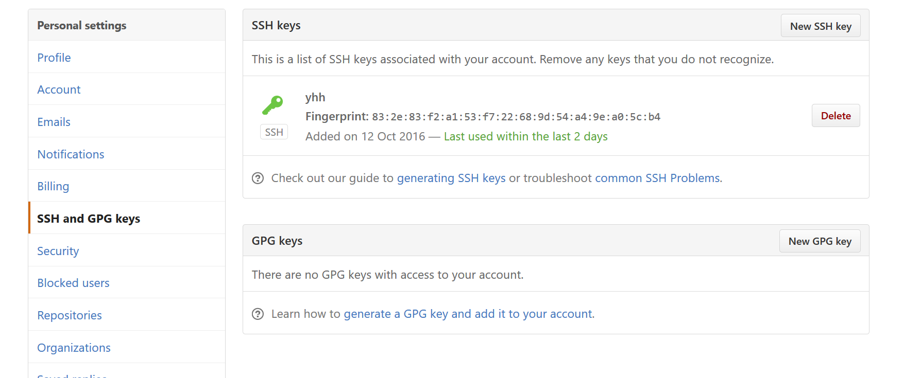
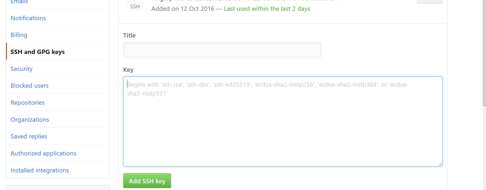

## 一、Git是什么

1、

2、

## 二、Git基本用法


一般来说，日常使用只要记住下图6个命令，就可以了。但是熟练使用，恐怕要记住60～100个命令。


下面是我整理的常用 Git 命令清单。几个专用名词的译名如下。

> - Workspace：工作区
> - Index / Stage：暂存区
> - Repository：仓库区（或本地仓库）
> - Remote：远程仓库

### 一、新建代码库

```bash
git init # 在当前目录新建一个Git代码库
git init [project-name] # 新建一个目录，将其初始化为Git代码库
git clone [url] # 下载一个项目和它的整个代码历史
```
### 二、配置

Git的设置文件为**.gitconfig**，它可以在用户主目录下（全局配置），也可以在项目目录下（项目配置）。

```bash
git config --list # 显示当前的Git配置
git config -e [--global] # 编辑Git配置文件
git config [--global] user.name "[name]" # 设置提交代码时的用户信息
git config [--global] user.email "[email address]" # 设置提交代码时的用户信息
```
### 三、增加/删除文件

```bash
git add [file1] [file2] ... # 添加指定文件到暂存区
git add [dir] # 添加指定目录到暂存区，包括子目录
git add . # 添加当前目录的所有文件到暂存区
git add -p # 添加每个变化前，都会要求确认，对于同一个文件的多处变化，可以实现分次提交
git rm [file1] [file2] ... # 删除工作区文件，并且将这次删除放入暂存区
git rm --cached [file] # 停止追踪指定文件，但该文件会保留在工作区
git mv [file-original] [file-renamed] # 改名文件，并且将这个改名放入暂存区
```
### 四、代码提交

```bash
git commit -m [message] # 提交暂存区到仓库区
git commit [file1] [file2] ... -m [message] # 提交暂存区的指定文件到仓库区
git commit -a # 提交工作区自上次commit之后的变化，直接到仓库区
git commit -v # 提交时显示所有diff信息
git commit --amend -m [message] # 使用一次新的commit，替代上一次提交,如果代码没有任何新变化，则用来改写上一次commit的提交信息
git commit --amend [file1] [file2] ... # 重做上一次commit，并包括指定文件的新变化
```
### 五、分支

```bash
# 列出所有本地分支
$ git branch

# 列出所有远程分支
$ git branch -r

# 列出所有本地分支和远程分支
$ git branch -a

# 新建一个分支，但依然停留在当前分支
$ git branch [branch-name]

# 新建一个分支，并切换到该分支
$ git checkout -b [branch]

# 新建一个分支，指向指定commit
$ git branch [branch] [commit]

# 新建一个分支，与指定的远程分支建立追踪关系
$ git branch --track [branch] [remote-branch]

# 切换到指定分支，并更新工作区
$ git checkout [branch-name]

# 切换到上一个分支
$ git checkout -

# 建立追踪关系，在现有分支与指定的远程分支之间
$ git branch --set-upstream [branch] [remote-branch]

# 合并指定分支到当前分支
$ git merge [branch]

# 选择一个commit，合并进当前分支
$ git cherry-pick [commit]

# 删除分支
$ git branch -d [branch-name]

# 删除远程分支
$ git push origin --delete [branch-name]
$ git branch -dr [remote/branch]
```
### 六、标签

```bash
# 列出所有tag
$ git tag

# 新建一个tag在当前commit
$ git tag [tag]

# 新建一个tag在指定commit
$ git tag [tag] [commit]

# 删除本地tag
$ git tag -d [tag]

# 删除远程tag
$ git push origin :refs/tags/[tagName]

# 查看tag信息
$ git show [tag]

# 提交指定tag
$ git push [remote] [tag]

# 提交所有tag
$ git push [remote] --tags

# 新建一个分支，指向某个tag
$ git checkout -b [branch] [tag]
```
### 七、查看信息

```bash
# 显示有变更的文件
$ git status

# 显示当前分支的版本历史
$ git log

# 显示commit历史，以及每次commit发生变更的文件
$ git log --stat

# 搜索提交历史，根据关键词
$ git log -S [keyword]

# 显示某个commit之后的所有变动，每个commit占据一行
$ git log [tag] HEAD --pretty=format:%s

# 显示某个commit之后的所有变动，其"提交说明"必须符合搜索条件
$ git log [tag] HEAD --grep feature

# 显示某个文件的版本历史，包括文件改名
$ git log --follow [file]
$ git whatchanged [file]

# 显示指定文件相关的每一次diff
$ git log -p [file]

# 显示过去5次提交
$ git log -5 --pretty --oneline

# 显示所有提交过的用户，按提交次数排序
$ git shortlog -sn

# 显示指定文件是什么人在什么时间修改过
$ git blame [file]

# 显示暂存区和工作区的差异
$ git diff

# 显示暂存区和上一个commit的差异
$ git diff --cached [file]

# 显示工作区与当前分支最新commit之间的差异
$ git diff HEAD

# 显示两次提交之间的差异
$ git diff [first-branch]...[second-branch]

# 显示今天你写了多少行代码
$ git diff --shortstat "@{0 day ago}"

# 显示某次提交的元数据和内容变化
$ git show [commit]

# 显示某次提交发生变化的文件
$ git show --name-only [commit]

# 显示某次提交时，某个文件的内容
$ git show [commit]:[filename]

# 显示当前分支的最近几次提交
$ git reflog
```
### 八、远程同步

```bash
git fetch [remote] # 下载远程仓库的所有变动
git remote -v # 显示所有远程仓库
git remote show [remote] # 显示某个远程仓库的信息
git remote add [shortname] [url] # 增加一个新的远程仓库，并命名
git pull [remote] [branch] # 取回远程仓库的变化，并与本地分支合并
git push [remote] [branch] # 上传本地指定分支到远程仓库
git push [remote] --force # 强行推送当前分支到远程仓库，即使有冲突
git push [remote] --all # 推送所有分支到远程仓库
```
### 九、撤销

```bash
git checkout [file] # 恢复暂存区的指定文件到工作区
git checkout [commit] [file] # 恢复某个commit的指定文件到暂存区和工作区
git checkout . # 恢复暂存区的所有文件到工作区
git reset [file] # 重置暂存区的指定文件，与上一次commit保持一致，但工作区不变
git reset --hard # 重置暂存区与工作区，与上一次commit保持一致
git reset [commit] # 重置当前分支的指针为指定commit，同时重置暂存区，但工作区不变
git reset --hard [commit] # 重置当前分支的HEAD为指定commit，同时重置暂存区和工作区，与指定commit一致
git reset --keep [commit] # 重置当前HEAD为指定commit，但保持暂存区和工作区不变
git revert [commit] # 新建一个commit，用来撤销指定commit，后者的所有变化都将被前者抵消，并且应用到当前分支
git stash # 暂时将未提交的变化移除，稍后再移入
git stash pop
```
### 十、其他

```bash
git archive # 生成一个可供发布的压缩包
```

### 十一、常见出错

如果输入

```bash
git remote add origin git@github.com:djqiang（github帐号名）/gitdemo（项目名）.git 
```

提示出错信息：
```bash
fatal: remote origin already exists.
```
解决办法如下：

1、先输入
```bash
git remote rm origin
```
2、再输入
```bash
git remote add origin git@github.com:djqiang/gitdemo.git
```
就不会报错了！

3、如果输入
```bash
git remote rm origin
```
还是报错的话，
```bash
error: Could not remove config section 'remote.origin'. 
```
我们需要修改**gitconfig**文件的内容。

4、找到你的github的安装路径，我的是
```
C:\Users\ASUS\AppData\Local\GitHub\PortableGit_ca477551eeb4aea0e4ae9fcd3358bd96720bb5c8\etc
```
5、找到一个名为gitconfig的文件，打开它把里面的[remote "origin"]那一行删掉就好了！
## 三、Github
```

```
### 三、github-如何设置SSH Key

##### 设置SSH Key

##### 在注册好github账号后，打开你的电脑桌面上的一个文件夹，这就建立了一个本地工作库，在里面点击鼠标右键，找到你的git bash here-点击开，如图所示：进行下面操作：

输入cd ~/.ssh——回车（看你是否有了ssh key 密钥，有了就备份）；

输入ssh-keygen -t rsa -C "your email"——直接回车，之后会让你输入github的账号密码，会出现如图所示结果，跟着上面所指示的路径，在你的电脑中找到该文件，id_rsa文件即是你的私有密钥，id_rsa.pub是共开密钥


打开你的id_rsa.pub文件，复制下里面的内容，然后登录进去你的github；


在右上角账户那里点击头像边上的下拉，出现如图——点击settings进去，找到左侧的SSH Keys,点击，如图；



在点击Add SSH Key，在title处填入任意的标识，在Key部分里面添加刚才复制的id_rsa.pub文件里的内容，点击添加即可；

最后只需测试一下链接是否正常即可。接着输入：ssh -T [git@github.com](mailto:git@github.com)，这时会问是否继续连接，我们输入 yes，这样，我们的git配置就完成了。