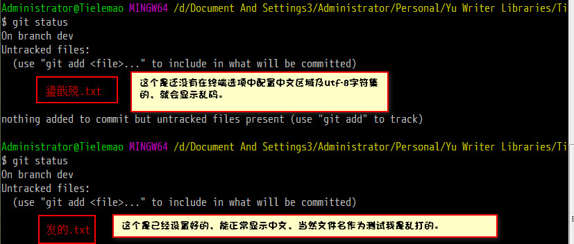
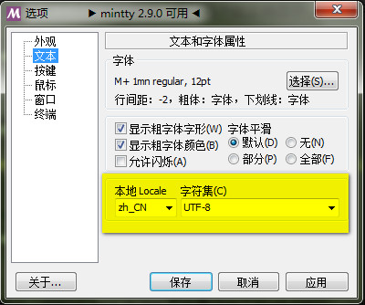

# Git问题总结

## 1、The file will have its original line endings in your working directory

出现这个问题主要原因是：我们从别人github地址上通过git clone下载下来，而又想git push到我们自己的github上，那么就会出现上面提示的错误信息

此时需要执行如下代码：
```bash
git rm -r --cached .
git config core.autocrlf false
git add .
```
. 代表当前目录

## 2、Git 的 config 有三级

### 2.1 最高级：`git config --system`

信息保存在 /etc/gitconfig

为系统设置配置。

### 2.2 第二级：`git config --global`

信息保存在 ~/.gitconfig 或 ~/.config/git/config

只针对当前用户。

### 2.3 第三级：`git congfig --local`

信息保存在当前仓库的Git目录中的 `.git/config`

只针对该仓库。

每一个级别覆盖上一级别的配置。

## 3、Git传输协议 和 HTTPS 传输协议

## 4、让git status 显示中文，解决中文乱码

### 4.1 问题描述

status查看有改动但未提交的文件时总只显示一串数字串，显示不出中文文件名，非常不方便。如下图： 


### 4.2 原因

  在默认设置下，中文在工作区状态输出时，不能正确显示，而是显示为八进制的字符编码。

### 4.3 解决办法一

将 git 配置文件 `core.quotepath`项设置为 false。 

quotepath 表示引用路径；加上`--global`表示全局配置。

可以直接在 git bash 终端输入命令：

```bash
git config --global core.quotepath false
```

但是注意，这样设置后，你的git bash终端也要设置成中文和utf-8编码，才能正确显示中文，不然还是乱码。

效果对比如下：



git bash 终端设置办法：

- 在git bash的界面中右击空白处，弹出菜单，选择 `选项->文本->本地Locale` ，设置为 `zh_CN` ，而旁边的字符集选框选为 `UTF-8` 。
- 如果是英文界面则是： 
  `Options->Text->Locale` 改为 `zh_CN，Character set改为UTF-8`

如图：



### 4.4 解决办法二

如果你的git bash终端没有菜单选项显示，还可以通过直接修改配置文件的方式来解决中文乱码问题。

进入git的安装目录：

1. 编辑 `etc\gitconfig` Git系统文件，也有些windows系统是存放在`C:\Users\Administrator\.gitconfig`路径或`安装盘符:\Git\mingw64\etc\gitconfig`，在文件末尾增加以下内容：

```bash
[gui]  
    encoding = utf-8  
    # 代码库统一使用utf-8  
[i18n]  
    commitencoding = utf-8  
    # log编码  
[svn]  
    pathnameencoding = utf-8  
    # 支持中文路径  
[core]
    quotepath = false 
    # status引用路径不再是八进制（反过来说就是允许显示中文了）
```

2. 编辑 `etc\git-completion.bash` 文件,在文件末尾增加以下内容：

```bash
# 让ls命令能够正常显示中文
alias ls='ls --show-control-chars --color=auto' 
```

3. 编辑 `etc\inputrc` 文件，修改 output-meta 和 convert-meta 属性值：

```bash
set output-meta on  # bash可以正常输入中文  
set convert-meta off  
```

4. 最后编辑profile文件，在文件末尾添加如下内容：

```bash
export LESSHARESET=utf-8
```

   

