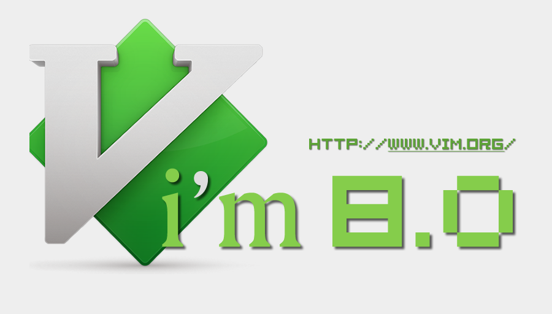
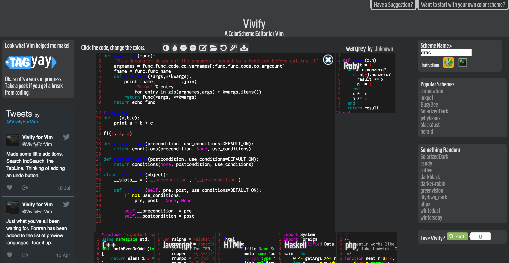
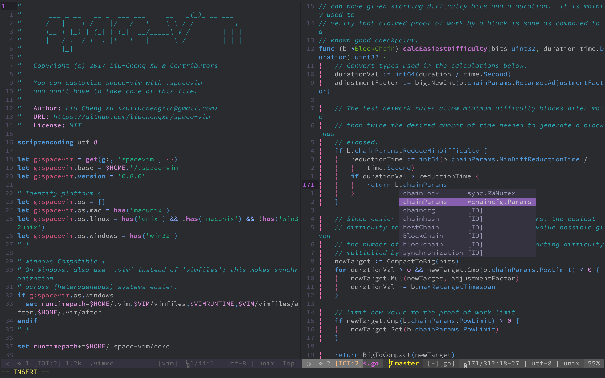
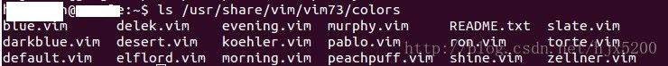
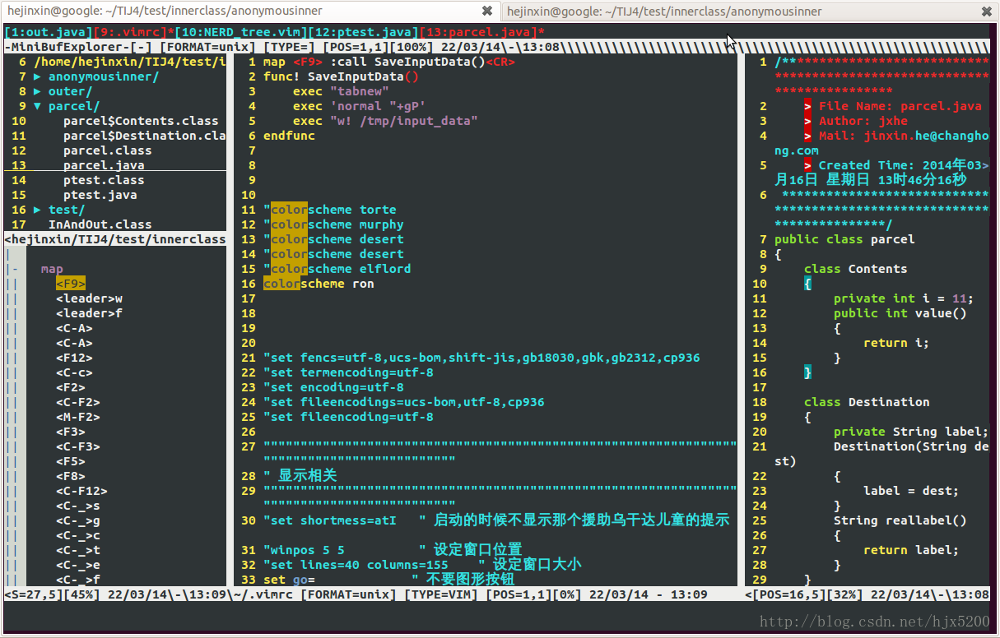
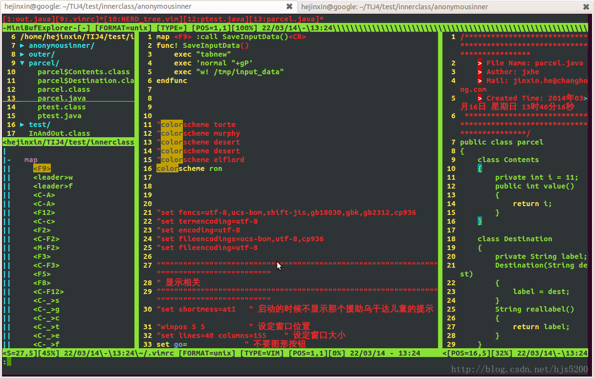
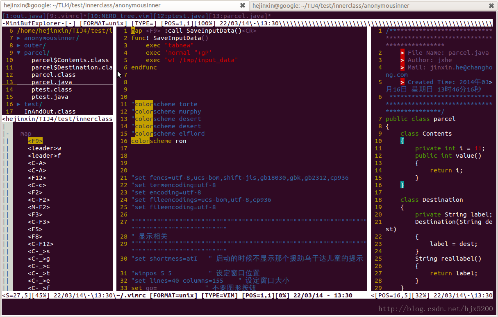

## 一、vi介绍


## 二、vim介绍

### 1、基本介绍
Vim is a highly configurable text editor for efficiently creating and changing any kind of text. It is included as "vi" with most UNIX systems and with Apple OS X. 

Vim is rock stable and is continuously being developed to become even better. Among its features are:

- persistent, multi-level undo tree
- extensive plugin system
- support for hundreds of programming languages and file formats
- powerful search and replace
- integrates with many tools

Vim 是经典的 UNIX 编辑器 Vi 的深度改良版本。它增加了许多功能，包括：多级撤销、格式高亮、命令行历史、在线帮助、拼写检查、文件名补完、块操作、脚本支持，等等。除了字符界面版本之外，它也有图形界面版本（比如 gVim）。虽然 Vi 还在继续维护当中，但是大部分人都只在使用 Vim 了，你所见到和听到的大多是指 Vim——虽然你的命令名可能是 Vi。

这个编辑器常用于程序员、系统管理员、黑客们进行编程和文本编辑。不像某些编辑器，它所有的命令都采用普通的键盘字符，因此在你的如飞般的十指之下，它的输入和操作速度非常快。当然，你也可以将功能键映射到某些命令上，甚至还可以支持鼠标。

除了 [Linux]之外，Vim 还可以运行在 MS-Windows （NT、2000、XP、Vista、7、8、10）、苹果、VMS 和几乎所有的 UNIX 分支上。 Vim 的旧版本还可以运行在 MS-DOS、MS-Windows 95/98/Me、Amiga DOS、Atari MiNT、BeOS、RISC OS 和 OS/2 上，不过新版本不再支持了。

通常情况下，国内使用的Ubuntu安装的vim是阉割版。想要完整版需要重装。

可以用

```bash
vim -v
```

查看自己的版本号。

2016年Vim终于发布了8.0版本，结束了从2006年5月7日开始的7.0世代。目前的最新版本是2018年5月18日发布的8.1版本。
### 2、新版功能
8.0 版本中除了大量的细节改进和错误修复以外，主要支持以下的新功能：

>#### 1. **支持异步 I/O 和通道channel**

Vim 现在可以和后台的其它进程进行消息交互。这样就可以开发一个运行在后台的服务器，并将结果发回给 Vim，这种交互方式称之为通道channel。在通道中使用 JSON 传递消息，因此你可以用任何一种语言来开发后台服务器，只需要它支持 JSON 即可。通过支持这种技术可以实现一些功能非常复杂的插件。

>#### 2. **任务**

Vim 现在也能启动一个任务，并与之通讯或停止它。比如说，可以启动一个用于自动补完、格式检查等功能的进程。在任务和 Vim 之间的通讯是通过通道完成的。

>#### 3. **定时器**

另外一个异步工作的是定时器timer，可以启动一个定时器并不断重复调用某个函数。比如：let tempTimer = timer_start(4000, 'CheckTemp') 。

>#### 4. **Partial**

Vim 已经有了一个 Funcref 功能，这是一个函数引用。partial 也是一个函数引用，但是它可以绑定参数或字典。这对于频道或定时器的回调很有用。 比如：let tempTimer = timer_start(4000, function('CheckTemp', ['out'])) 。

>#### 5. **Lambda 和闭包**

lambda 是创建函数最快的方式，比如：{args -> expr}。它对于 filter() 和 map() 很有用，而且还支持函数参数。如：call filter(mylist, {idx, val -> val > 20})。

lambda 可以使用定义 lambda 表达式范围内的变量，这常被称之为闭包closure。

>#### 6. **插件包**

插件越来越多了，为了更好的管理插件，因此支持了插件包的支持。

>#### 7. **窗口 ID**

以前 Vim 中的窗口只能通过数字编号来访问，当打开、关闭或移动窗口时，这个数字也随之而变。现在每个窗口都有了一个唯一的 ID，可以更方便的找到它们。

>#### 8. **折行缩进**

新增的 'breakindent' 选项可以保证在折行时维持缩进不变。

>#### 9. **Windows：支持 DirectX**

新增的 'renderoptions' 选项可以在 Windows 上切换到 DirectX （DirectWrite）引擎上。

>#### 10. **支持 GTK+ 3**

一般用户很难注意到 GTK+ 3 和 GTK+ 2 的区别。对这两者的配置仍然都支持。

更多的变化细节，可以参考官网。

### 三、下载:

得到最新版本的 Vim 的最好方式是使用 Git ：

git clone https://github.com/vim/vim.git

更多信息可参考： http://www.vim.org/git.php 。

1. **UNIX/Linux**

源代码及运行时文件： ftp://ftp.vim.org/pub/vim/unix/vim-8.0.tar.bz2 。

在 Linux 下，你总可以使用你的软件包管理器来安装最新的 Vim 8.0，不过如果你的发行版仓库还没有提供的新的 8.0 的话，你可以享受一下自己编译的乐趣。

如果你希望按照你自己的想法定制一个 Vim，那你可以下载源代码，并在 src 目录里面进行编译，可以参考 src/INSTALL 了解如何编译和安装。

2. **Windows**

```bash
安装程序：`ftp://ftp.vim.org/pub/vim/pc/gvim80.exe`

运行时文件：` ftp://ftp.vim.org/pub/vim/pc/vim80rt.zip`

Windows 95/98/NT/2000/XP/7 图形界面版：`ftp://ftp.vim.org/pub/vim/pc/gvim80.zip`

带有 OLE 支持的版本： `ftp://ftp.vim.org/pub/vim/pc/gvim80ole.zip`

Windows NT/2000/XP/7 字符界面版：`ftp://ftp.vim.org/pub/vim/pc/vim80w32.zip`
```
8.0 不再支持的版本

1. 16 位的 DOS、OS/2 和 Amiga 版本
2. 32 位的 MS-DOS/Windows 95/98 的字符界面版
3. 16 位的 MS-Windows 版本

### 四、文档与帮助

对于初学者来说，有一个叫  vimtutor 的一小时教程可以看看（当然是英文的），请通过 :help tutor 了解更多信息。

学习 Vim 的最好方式之一是在 Vim 中使用:help，如果你还没有 Vim 二进制程序，你也可以看看 runtime/doc/help.txt，它包含了对其它文档的指引。这个用户手册就像一本书一样，推荐使用它来学习 Vim。详见 :help user-manual。

## 三、常用配置

vim的全局配置在文件
```bash
/etc/vim/vimrc
```
里。作为多用户管理系统，不建议直接修改这里的文件，而是在自己的家目录下修改vim配置。

我们可以先看一眼全局配置的内容：

```bash
cat /etc/vim/vimrc
```

输出为：

```bash
" All system-wide defaults are set in $VIMRUNTIME/debian.vim and sourced by
" the call to :runtime you can find below.  If you wish to change any of those
" settings, you should do it in this file (/etc/vim/vimrc), since debian.vim
" will be overwritten everytime an upgrade of the vim packages is performed.
" It is recommended to make changes after sourcing debian.vim since it alters
" the value of the 'compatible' option.

" This line should not be removed as it ensures that various options are
" properly set to work with the Vim-related packages available in Debian.
runtime! debian.vim

" Uncomment the next line to make Vim more Vi-compatible
" NOTE: debian.vim sets 'nocompatible'.  Setting 'compatible' changes numerous
" options, so any other options should be set AFTER setting 'compatible'.
"set compatible

" Vim5 and later versions support syntax highlighting. Uncommenting the next
" line enables syntax highlighting by default.
if has("syntax")
  syntax on
endif

" If using a dark background within the editing area and syntax highlighting
" turn on this option as well
"set background=dark

" Uncomment the following to have Vim jump to the last position when
" reopening a file
"if has("autocmd")
"  au BufReadPost * if line("'\"") > 1 && line("'\"") <= line("$") | exe "normal! g'\"" | endif
"endif

" Uncomment the following to have Vim load indentation rules and plugins
" according to the detected filetype.
"if has("autocmd")
"  filetype plugin indent on
"endif

" The following are commented out as they cause vim to behave a lot
" differently from regular Vi. They are highly recommended though.
"set showcmd		" Show (partial) command in status line.
"set showmatch		" Show matching brackets.
"set ignorecase		" Do case insensitive matching
"set smartcase		" Do smart case matching
"set incsearch		" Incremental search
"set autowrite		" Automatically save before commands like :next and :make
"set hidden		" Hide buffers when they are abandoned
"set mouse=a		" Enable mouse usage (all modes)

" Source a global configuration file if available
if filereadable("/etc/vim/vimrc.local")
  source /etc/vim/vimrc.local
endif
```


```
syntax on
set number
set shiftwidth=4
set softtabstop=4
set tabstop=4
set expandtab
set expandtab
set showcmd
set cursorline
filetype indent on
```

## 

改变vim配色：安装colorscheme


主要有两种方式安装colorscheme：

1. 自行下载colorscheme安装，下载的文件扩展名通常为.vim。
2. 通过安装相关vim的插件获取。

### 1、自行下载colorscheme安装

在vim的配置文件`.vimrc`中配色方案的设置`colorscheme foo`为：

```
set t_Co=256 " required
colorscheme desert12
```

不过有时候我们对于自带的配色方案不太满意，那要怎么自己安装一些配色方案呢？主要分三步：

1. 在当前用户目录 `~/` 下的 `.vim` 目录(如果没有，`mkdir ~/.vim`进行新建该目录)。在 `~/.vim/` 下新建一个叫 `colors`的目录，我们下一步下载的配色方案.vim文件便放到该目录下。
2. 到一个配色网站上选择一个配色方案下载到 `~/.vim/colors` 目录下面。这里推荐一个非常好的网站: [A ColorScheme Editor for Vim](http://bytefluent.com/vivify/), 这个网站不仅有很多的配色方案可供选择，还能自行进行编辑(比如变亮或变暗)再下载。比如我们看好了一个叫molokai的配色方案，点击下载按钮后下载 molokai.vim 的文件到 `~/.vim/colors` 目录下面 
   
3. 修改 `.vimrc` 配置文件：`colorscheme molokai`，退出再打开vim就能看到效果了。

>注：网站上看到的配色方案效果仅供参考，不一定与实际使用的效果一样。

### 2、使用插件安装

vim插件：<https://github.com/flazz/vim-colorschemes>，使用插件管理器进行快速安装，安装完成后直接设置即可。

### 自己写一个 colorscheme

其实很简单，照葫芦画瓢即可，可以看我自己按照 spacemacs dark theme 修改的 [space-vim-dark](https://github.com/liuchengxu/space-vim-dark) colorscheme,



打开 colors 下面的 colorscheme, 其实很简单，完全可以自己写一个，主要内容差不多都是这样：

```
hi Function        ctermfg=134   guifg=#af5fd7 gui=bold            cterm=bold
hi Identifier      ctermfg=98    guifg=#875fd7 gui=bold           cterm=bold12
```

hi 就是 highlight，后面跟上一个类型，比如 Function, 就是指函数了，cterm 指的是 terminal 中的样式，比如加粗 bold，下划线 underline, gui 指的是 GUI vim中的样式，fg指的是 front ground前景色，bg 指的是 background 背景色, 基本就是如此了。

调教一番就能使用了。

reddit 上也有一个关于创建 Colorscheme 的讨论：[Creating Your Lovely Color Scheme](https://www.reddit.com/r/vim/comments/7auw18/creating_your_lovely_color_scheme_vimconf2017/)


Vim的颜色主题在
```bash
/usr/share/vim/vim74/colors
```
文件夹里。其中**vim74**文件夹名跟你所使用的vim版本号有关，如果是7.3版本，则是vim73。打开vim后在normal模式下输入“：colorscheme”查看当前的主题，修改主题使用命令“：colorscheme mycolor”，其中mycolor是你usr/share/vim/vim74/colors文件夹包含的文件名。也可以把这个命令写入~/.vimrc配置文件中，这样每次打开Vim都是你设定的主题。



上面是默认就会安装的colorscheme选项。
```
blue.vim      README.txt 
desert.vim    
koehler.vim  
peachpuff.vim  
slate.vim
darkblue.vim  
elflord.vim   
morning.vim      
torte.vim
default.vim   
evening.vim   
murphy.vim   
ron.vim        
zellner.vim
delek.vim     
industry.vim  
pablo.vim    
shine.vim
```

README.txt里的内容如下     

>   1 README.txt for color scheme files 
>
>   2 
>
>   3 These files are used for the ":colorscheme" command.  They appear in the
>
>   4 Edit/Color Scheme menu in the GUI.
>
>   5 
>
>   6 
>
>   7 Hints for writing a color scheme file:
>
>   8 
>
>   9 There are two basic ways to define a color scheme:
>
>   10 
>
>   11 1. Define a new Normal color and set the 'background' option accordingly.
>
>   12     set background={light or dark}
>
>   13     highlight clear
>
>   14     highlight Normal ...
>
>   15     ...
>
>   16 
>
>   17 2. Use the default Normal color and automatically adjust to the value of
>
>   18    'background'.
>
>   19     highlight clear Normal
>
>   20     set background&
>
>   21     highlight clear
>
>   22     if &background == "light"
>
>   23       highlight Error ...
>
>   24       ...
>
>   25     else
>
>   26       highlight Error ...
>
>   27       ...
>
>   28     endif
>
>   29 
>
>   30 You can use ":highlight clear" to reset everything to the defaults, and then
>
>   31 change the groups that you want differently.  This also will work for groups
>
>   32 that are added in later versions of Vim.
>
>   33 Note that ":highlight clear" uses the value of 'background', thus set it
>
>   34 before this command.
>
>   35 Some attributes (e.g., bold) might be set in the defaults that you want
>
>   36 removed in your color scheme.  Use something like "gui=NONE" to remove the
>
>   37 attributes.
>
>   38 
>
>   39 In case you want to set 'background' depending on the colorscheme selected,
>
>   40 this autocmd might be useful:
>
>   41      autocmd SourcePre */colors/blue_sky.vim set background=dark
>
>   42 Replace "blue_sky" with the name of the colorscheme.
>
>   43 
>
>   44 In case you want to tweak a colorscheme after it was loaded, check out that
>
>   45 ColorScheme autocmd event.
>
>   46 
>
>   47 To see which highlight group is used where, find the help for
>
>   48 "highlight-groups" and "group-name".
>
>   49 
>
>   50 You can use ":highlight" to find out the current colors.  Exception: the
>
>   51 ctermfg and ctermbg values are numbers, which are only valid for the current
>
>   52 terminal.  Use the color names instead.  See ":help cterm-colors".
>
>   53 
>
>   54 The default color settings can be found in the source file src/syntax.c.
>
>   55 Search for "highlight_init".
>
>   56 
>
>   57 If you think you have a color scheme that is good enough to be used by others,
>
>   58 please check the following items:
>
>   59 
>
>   60 - Does it work in a color terminal as well as in the GUI?
>
>   61 - Is "g:colors_name" set to a meaningful value?  In case of doubt you can do
>
>   62   it this way:
>
>   63     let g:colors_name = expand('<sfile>:t:r')
>
>   64 - Is 'background' either used or appropriately set to "light" or "dark"?
>
>   65 - Try setting 'hlsearch' and searching for a pattern, is the match easy to
>
>   66   spot?
>
>   67 - Split a window with ":split" and ":vsplit".  Are the status lines and
>
>   68   vertical separators clearly visible?
>
>   69 - In the GUI, is it easy to find the cursor, also in a file with lots of
>
>   70   syntax highlighting?
>
>   71 - Do not use hard coded escape sequences, these will not work in other
>
>   72   terminals.  Always use color names or #RRGGBB for the GUI.    


下面给出几个主题的实例，选择自己喜欢的，让你的Vim炫起来！



上图是evening主题



上图murphy主题



上图peachpuff主题

## 四、插件

## 五、常用操作


## 六、异常

### Vim YouCompleteMe异常

异常信息如下：

```bash
The ycmd server SHUT DOWN (restart with ':YcmRestartServer'). 
Unexpected error while loading the YCM core library. 
Use the ':YcmToggleLogs' command to check the logs.123
```

1. 重装YouCompleteMe

```
python3 YouCompleteMe/install.py --clang-completer --racer-completer1
```

2. 安装YouCompleteMe过程中提示cargo异常

```
ERROR: cargo is required for the Rust completer.1
```

如果提示cargo异常，需要安装cargo，命令如下：

```
curl -sSf https://static.rust-lang.org/rustup.sh | sh1
```

cargo安装成功后再重试上述步骤1

### 参考

> [“ycmd server SHUTDOWN” error](https://github.com/Valloric/YouCompleteMe/issues/2579)
>
> [Cargo, Rust’s Package Manager](http://doc.crates.io/)


