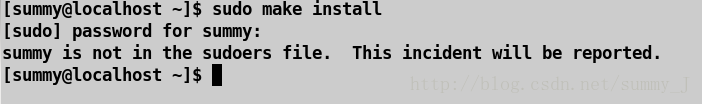
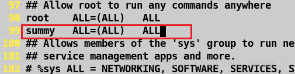
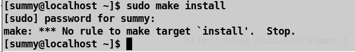

## 1.原因

当有时候我们使用sudo命令切换用户的时候可能会遇到提示以下错误：

**xxx is not in the sudoers file. This incident will be reported**

xxx是你当前的用户名，其实就是因为这个用户没有加入到sudo的配置文件里，解决办法就是打开配置文件加入用户权限。

------

## 2.解决

step1：用su换为root用户，并输入以下命令进入sudo配置文件

step2：在配置文件里找到下边的位置，并加入用户权限，保存退出。

step3：再次使用sudo命令就不会出现报错信息了。

