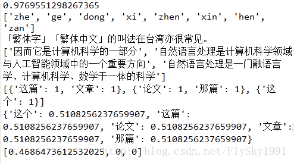
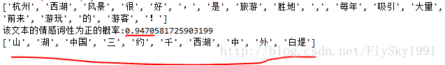
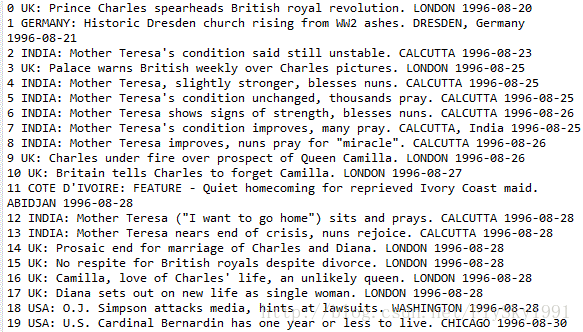
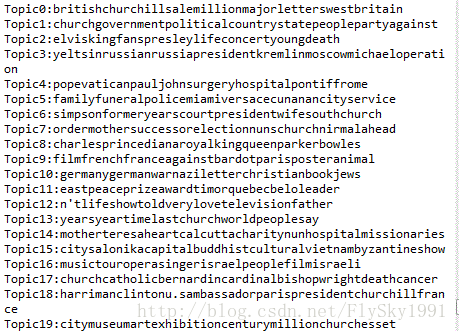

# 自热语言处理入门

<!-- TOC -->

- [一、文本相似度计算](#一文本相似度计算)
    - [TF-IDF模型](#tf-idf模型)
    - [LSI模型](#lsi模型)
    - [LDA模型](#lda模型)
- [二、中文文本处理利器snownlp](#二中文文本处理利器snownlp)
- [三、Word2Vec](#三word2vec)
    - [电商评论数据获取](#电商评论数据获取)
    - [中文分词](#中文分词)
    - [Word2Vec测试](#word2vec测试)
- [四、中文分词原理及分词工具介绍](#四中文分词原理及分词工具介绍)
    - [中文分词原理介绍](#中文分词原理介绍)
        - [中文分词概述](#中文分词概述)
        - [中文分词方法介绍](#中文分词方法介绍)
            - [基于字符串匹配的分词方法](#基于字符串匹配的分词方法)
            - [基于理解的分词方法](#基于理解的分词方法)
            - [基于统计的分词方法](#基于统计的分词方法)
    - [中文分词工具介绍](#中文分词工具介绍)
        - [jieba (github star数 9003)](#jieba-github-star数-9003)
        - [SnowNLP(github star数 2043)](#snownlpgithub-star数-2043)
        - [THULAC (github star数 311)](#thulac-github-star数-311)
        - [NLPIR (github star数 811)](#nlpir-github-star数-811)
- [五、基于WordArt的AGM手机评论词频分析](#五基于wordart的agm手机评论词频分析)
    - [获取评论数据](#获取评论数据)
    - [用WordArt做词频分析](#用wordart做词频分析)
- [六、基于LDA的文章主题生成](#六基于lda的文章主题生成)
    - [LDA概述](#lda概述)
    - [基于LDA的文章主题生成](#基于lda的文章主题生成)
- [七、基于TF-IDF的文本自动打标](#七基于tf-idf的文本自动打标)
    - [TF-IDF简介](#tf-idf简介)
    - [应用案例](#应用案例)
- [八、TextRank](#八textrank)

<!-- /TOC -->

# 一、文本相似度计算

**文本相似度计算**在信息检索、数据挖掘、机器翻译、文档复制检测等领域有着广泛的应用。文本相似度常用的计算方法有**TF-IDF**、**LSI**、**LDA**等。

## TF-IDF模型

**TF-IDF（Term Frequency-Inverse Document Frequency）**是一种统计方法，用以评估某一字词对于一个文件集或一个语料库中的其中一份**文件**的**重要程度**。

> **字词**的重要性随着它在**文件**中出现的次数成**正比增加**，但同时会随着它在**语料库**中出现的**频率**成**反比下降**。

**TF-IDF**加权的各种形式常被**搜寻引擎**应用，作为**文件与用户查询之间相关程**度的度量或评级。

在一份给定的文件里，**词频 (term frequency, TF)** 指的是**某一个给定的词语在该文件中出现的次数**。这个数字通常会被**归一化**，以防止它偏向长的文件。

**逆向文件频率 (inverse document frequency, IDF)** 是一个**词语普遍重要性的度量**。某一特定词语的IDF，可以由总文件数目除以包含该词语之文件的数目，再将得到的商取对数得到。

**某一特定文件内的高词语频率，以及该词语在整个文件集合中的低文件频率，可以产生出高权重的TF-IDF**。因此，TF-IDF倾向于**过滤掉常见的词语，保留重要的词语**。 

**TF-IDF**的主要思想是：**如果某个词或短语在一篇文章中出现的频率TF高，并且在其他文章中很少出现，则认为此词或者短语具有很好的类别区分能力，适合用来分类。**

## LSI模型

**LSI（Latent Semantic Indexing）**又称为**潜在语义分析(LSA)**，是在信息检索领域提出来的一个概 念。主要用于解决**一词多义**（如**“bank”**一词，可以指银行，也可以指河岸）和**一义多词**（如**“car”**和**“automobile”**具有相同的含义）。依靠余弦相似性的方法并不能很好地解决上述问题，所以提出了**潜在语义索引**的方法，利用**SVD降维**的方法**将词项和文本映射到一个新的空间**。

## LDA模型

**LDA（Latent Dirichlet Allocation）**是一种**文档主题生成模型**，也称为一个**三层贝叶斯概率**模型，包含**词**、**主题**和**文档**三层结构。所谓生成模型，就是说，我们认为一篇文章的每个词都是通过“**以一定概率选择了某个主题，并从这个主题中以一定概率选择某个词语**”这样一个过程得到。**文档到主题服从多项式分布，主题到词服从多项式分布**。

**LDA**是一种非监督机器学习技术，可以用来**识别大规模文档集**（document collection）或**语料库**（corpus）中**潜藏的主题信息**。它采用了词袋（bag of words）的方法，这种方法**将每一篇文档视为一个词频向量**，从而将**文本信息**转化为了易于建模的**数字信息**。但是词袋方法没有考虑词与词之间的顺序，这简化了问题的复杂性，同时也为模型的改进提供了契机。**每一篇文档**代表了**一些主题所构成的一个概率分布**，而**每一个主题**又代表了**很多单词所构成的一个概率分布**。

# 二、中文文本处理利器snownlp

**SnowNLP**是一个python写的类库，可以方便的处理**中文文本**内容。如**中文分词**、**词性标注**、**情感分析**、**文本分类**、**提取文本关键词**、**文本相似度计算**等。

**snownlp**示例如下所示：

```python
# -*- coding: utf-8 -*-
"""
Created on Wed May 31 22:28:23 2017

@author: Administrator
"""

from snownlp import SnowNLP

s = SnowNLP(u'这个东西真心很赞')

s.words         # [u'这个', u'东西', u'真心',
                #  u'很', u'赞']

s.tags          # [(u'这个', u'r'), (u'东西', u'n'),
                #  (u'真心', u'd'), (u'很', u'd'),
                #  (u'赞', u'Vg')]

print(s.sentiments)    # 0.9769663402895832 positive的概率
#汉转拼音
print(s.pinyin)        # [u'zhe', u'ge', u'dong', u'xi',
                       #  u'zhen', u'xin', u'hen', u'zan']

s = SnowNLP(u'「繁體字」「繁體中文」的叫法在臺灣亦很常見。')
#简转繁
print(s.han)    # u'「繁体字」「繁体中文」的叫法在台湾亦很常见。'

text = u'''
自然语言处理是计算机科学领域与人工智能领域中的一个重要方向。
它研究能实现人与计算机之间用自然语言进行有效通信的各种理论和方法。
自然语言处理是一门融语言学、计算机科学、数学于一体的科学。
因此，这一领域的研究将涉及自然语言，即人们日常使用的语言，
所以它与语言学的研究有着密切的联系，但又有重要的区别。
自然语言处理并不是一般地研究自然语言，
而在于研制能有效地实现自然语言通信的计算机系统，
特别是其中的软件系统。因而它是计算机科学的一部分。
'''

s = SnowNLP(text)
s.keywords(3)   # [u'语言', u'自然', u'计算机']
print(s.summary(3)) # [u'因而它是计算机科学的一部分',
                    #  u'自然语言处理是一门融语言学、计算机科学、数学于一体的科学',
                    #  u'自然语言处理是计算机科学领域与人工智能领域中的一个重要方向']
s.sentences

s = SnowNLP([[u'这篇', u'文章'],
             [u'那篇', u'论文'],
             [u'这个']])
print(s.tf)   #词频
print(s.idf)  #逆向文件频率
print(s.sim([u'文章']))  # [0.3756070762985226, 0, 0]

```

运行结果如下图所示：




# 三、Word2Vec

**Word2Vec**是2013年Google开源的一款用于**词向量计算**的工具，由于其可以在百万数量级的词典和上亿的数据集上进行高效地训练，且该工具得到的词向量，可以很好地**度量词与词之间的相似性**，在学术界和工业界都得到了广泛的应用。

word2vec采用的是**n元语法模型**(n-gram model)，即假设一个词只与周围n个词有关，而与文本中的其他词无关。其训练词向量有两种方式：**CBOW**和**Skip-gram**。 
（1）CBOW（Continuous Bag of words,连续词袋模型）：用其上下文词，来预测当前词生成的概率。 
（2）Skip-Gram：用当前词去预测上下文词的生成概率。

本文就以Python中的**gensim**为例，介绍下Word2Vec的特性。主要可以分为**电商评论数据获取**、**中文分词**、**Word2Vec测试**三部分。

## 电商评论数据获取

本文的测试数据集来自于华为荣耀天猫旗舰店荣耀V10手机的评论数据（天猫页面链接：<https://detail.tmall.com/item.htm?spm=a1z10.1-b-s.w13636028-15291748785.6.70ea7f34skZgjc&id=562003579553&sku_properties=10004:653780895;5919063:6536025>），共计3000条。

获取天猫评论数据的方法，在链接<http://blog.csdn.net/flysky1991/article/details/74586286> 
中有详细说明，就不再多说了。实现代码如下所示：

```python
# -*- coding: utf-8 -*-
"""
Created on Thu Feb  1 18:10:52 2018

@author: zch
"""


import requests
import json
import time
import random
import pymysql.cursors

'''
荣耀V10天猫原始链接：https://detail.tmall.com/item.htm?spm=a1z10.1-b-s.w13636028-15291748785.6.70ea7f34skZgjc&id=562003579553&sku_properties=10004:653780895;5919063:6536025
'''


def crawlProductComment(url,page):

    #商品评论的JSON数据
    #url = 'https://rate.tmall.com/list_detail_rate.htm?itemId=562003579553&spuId=101717810&spuId=101717810&sellerId=1114511827&order=3&currentPage=1&append=⊙&content=1'
    req = requests.get(url)
    jsondata = req.text[15:]
    data = json.loads(jsondata)

    #输出页面信息
    print("正在获取第{}页的评论数据！".format(data['paginator']['page']))
    j = 0
    k = 0
    #遍历评论信息列表
    for i in data["rateList"]:
        j = j + 1
        if page < 10:
            if j < 10:
                k = '00' + str(page) + '0' + str(j)
            else:
                k = '00' + str(page) + str(j)
        elif page < 100:
            if j < 10:
                k = '0' + str(page) + '0' + str(j)
            else:
                k = '0' + str(page) + str(j)
        else:
            if j < 10:
                k = str(page) + '0' + str(j)
            else:
                k = str(page) + str(j)
        #输出商品sku信息
        auctionSku = i['auctionSku']
        rateDate = i['rateDate']
        rateContent = i['rateContent']

        info = i['appendComment']
        if info:
            appendCommentTime = info['commentTime']
            appendCommentContent = info['content']
        else:
            appendCommentTime = ""
            appendCommentContent = ""


        print("第{}个商品的sku:{}".format(k,auctionSku))
        #输出评论时间和评论内容
        print("评论时间：{}".format(rateDate))
        print("评论内容：{}".format(rateContent))
        info = i['appendComment']
        #判断是否有追加评论
        if info:
            print("追评时间:{}".format(appendCommentTime))
            print("追评内容:{}".format(appendCommentContent))
        print("-------------------------------------------------")

        '''
        数据库操作
        '''

        #获取数据库链接
        connection  = pymysql.connect(host = 'localhost',
                                  user = 'root',
                                  password = '123456',
                                  db = 'tmall',
                                  charset = 'utf8mb4')
        try:
            #获取会话指针
            with connection.cursor() as cursor:
                #创建sql语句
                sql = "insert into `HonorV10_Comment` (`id`,`auctionSku`,`rateDate`,`rateContent`,`appendCommentTime`,`appendCommentContent`) values (%s,%s,%s,%s,%s,%s)"

                #执行sql语句
                cursor.execute(sql,(k,auctionSku,rateDate,rateContent,appendCommentTime,appendCommentContent))

                #提交数据库
                connection.commit()
        finally:
            connection.close()


for i in range(l,151):
    #print("正在获取第{}页评论数据!".format(i+1))
    #获取荣耀V10评论JSON链接,通过更改page参数的值来循环读取多页评论信息
    #itemId:"562003579553",sellerId:"1114511827",shopId:"101717810"
    url = 'https://rate.tmall.com/list_detail_rate.htm?itemId=562003579553&spuId=101717810&spuId=101717810&sellerId=1114511827&order=3&currentPage=' + str(i) +'&append=⊙&content=1'
    crawlProductComment(url,i)
    #设置休眠时间
    time.sleep(random.randint(32,66))

```

## 中文分词

本文采用的是jieba来对评论数据进行分词操作。实现代码如下所示：

```python
# -*- coding: utf-8 -*-
"""
Created on Wed Feb  7 11:23:27 2018

@author: zch
"""

import pandas as pd
import pymysql.cursors
import re
import jieba

'''
数据库操作
'''

#获取数据库链接
connection  = pymysql.connect(host = 'localhost',
                          user = 'root',
                          password = '123456',
                          db = 'tmall',
                          charset = 'utf8mb4')
try:
    #获取会话指针
    with connection.cursor() as cursor:
        #创建sql语句
        sql = "select * from `HonorV10_Comment` limit 3000"

        #执行sql语句
        cursor.execute(sql)
        data = cursor.fetchall()
        #print(data[1000])
        #print(data[1][1])
        #提交数据库
        connection.commit()
finally:
    connection.close()

f1 = open("tmall_review.txt",'a') 
for i in range(0,3000):
    line = data[i][3]
    print(line)
    # 中文的编码范围是：\u4e00到\u9fa5 
    p2 = re.compile(r'[^\u4e00-\u9fa5]')  
    result = " ".join(p2.split(line)).strip() 
    #line.replace('\t','').replace('\n','').replace(' ','')
    cutline = jieba.cut(result,cut_all=False)
    f1.write(" ".join(cutline))

f1.close()

```

## Word2Vec测试

首先，读取经过jieba分词的评论数据，然后分别测试词语之间的相似度、某个词的相关词表和词语间的对应关系。实现代码如下所示：

```python
# -*- coding: utf-8 -*-
"""
Created on Wed Feb  7 11:21:39 2018

@author: zch
"""

from gensim.models import word2vec
import logging
import pandas as pd

# 主程序  
logging.basicConfig(format='%(asctime)s:%(levelname)s: %(message)s', level=logging.INFO)  


# 加载语料,默认为utf-8编码
sentences =word2vec.Text8Corpus(u"D:\\data/tmall/tmall_review.txt")


#训练skip-gram模型，默认window=5
model =word2vec.Word2Vec(sentences,size=200)    

print(model)

# 计算两个词的相似度/相关程度  
try:  
    #最新版本的用法，老版本用法为y1 = model.similarity(u"苹果", u"华为")，下同。  
    y1 = model.wv.similarity(u"华为", u"手机")  
except KeyError:  
    y1 = 0  
print (u"【华为】和【手机】的相似度为：", y1)  
print("------------------------\n")

#计算某个词的相关词列表(topn=10)
y2 = model.wv.most_similar(u"物流",topn=10)
print(u"和【物流】最相关的词有：\n")
for item in y2:
    print(item[0], item[1])
print("------------------------\n")

# 寻找对应关系  
print (u"上网-流畅，拍照-")  
y3 =model.wv.most_similar([u'上网', u'流畅'], [u'拍照'],topn=5)  
for item in y3:  
    print(item[0], item[1])  
print("------------------------\n")

```


# 四、中文分词原理及分词工具介绍

本文首先介绍下**中文分词**的**基本原理**，然后介绍下国内比较流行的**中文分词工具**，如**jieba**、**SnowNLP**、**THULAC**、**NLPIR**，上述分词工具都已经在**github**上开源，后续也会附上github链接，以供参考。

## 中文分词原理介绍

### 中文分词概述

**中文分词(Chinese Word Segmentation)** 指的是**将一个汉字序列切分成一个一个单独的词**。**分词**就是**将连续的字序列按照一定的规范重新组合成词序列的过程**。

### 中文分词方法介绍

现有的**分词方法**可分为三大类：**基于字符串匹配的分词方法**、**基于理解的分词方法**和**基于统计的分词方法**。

#### 基于字符串匹配的分词方法

**基于字符串匹配的分词方法**又称**机械分词方法**，它是按照**一定的策略**将**待分析的汉字串**与一个“**充分大的”机器词典**中的词条进行配，**若在词典中找到某个字符串**，则**匹配成功**（识别出一个词）。

按照**扫描方向**的不同，字符串匹配分词方法可以分为**正向匹配**和**逆向匹配**；按照**不同长度优先匹配**的情况，可以分为**最大（最长）匹配**和**最小（最短）匹配**；按照**是否与词性标注过程相结合**，可以分为**单纯分词方法**和**分词与词性标注相结合的一体化方法**。常用的**字符串匹配方法**有如下几种：

（1）**正向最大匹配法**（从左到右的方向）；

（2）**逆向最大匹配法**（从右到左的方向）；

（3）**最小切分**（每一句中切出的词数最小）；

（4）**双向最大匹配**（进行从左到右、从右到左两次扫描）

这类算法的**优点是速度快**，时间复杂度可以保持在O（n）,实现简单，效果尚可；但对**歧义**和**未登录词**处理效果不佳。

#### 基于理解的分词方法

**基于理解的分词方法**是**通过让计算机模拟人对句子的理解**，达到识别词的效果。其**基本思想**就是**在分词的同时进行句法、语义分析**，利用**句法信息**和**语义信息**来**处理歧义**现象。它通常包括三个部分：**分词子系统**、**句法语义子系统**、**总控部分**。在**总控部分**的协调下，**分词子系统可以获得有关词、句子等的句法和语义信息来对分词歧义进行判断**，即它模拟了人对句子的理解过程。这种分词方法**需要使用大量的语言知识和信息**。由于汉语语言知识的笼统、复杂性，难以将各种语言信息组织成机器可直接读取的形式，因此目前基于理解的分词系统还处在**试验阶段**。

#### 基于统计的分词方法

**基于统计的分词方法**是在**给定大量已经分词的文本**的前提下，**利用统计机器学习模型学习词语切分的规律**（称为**训练**），从而实现**对未知文本的切分**。例如**最大概率分词方法**和**最大熵分词方法**等。随着大规模语料库的建立，统计机器学习方法的研究和发展，**基于统计的中文分词方法渐渐成为了主流方法**

主要的**统计模型**有：**N元文法模型**（N-gram），**隐马尔可夫模型**（Hidden Markov Model ，HMM），**最大熵模型**（ME），**条件随机场模型**（Conditional Random Fields，CRF）等。

在实际的应用中，**基于统计的分词系统**都需要使用**分词词典**来**进行字符串匹配分词**，同时**使用统计方法识别一些新词**，即将**字符串频率统计**和**字符串匹配**结合起来，既发挥**匹配分词切分速度快、效率高的特点**，又利用了**无词典分词结合上下文识别生词、自动消除歧义的优点**。

## 中文分词工具介绍

### jieba (github star数 9003)

**jieba分词**是国内使用人数最多的**中文分词工具**（github链接：<https://github.com/fxsjy/jieba>）。**jieba分词**支持**三种模式**：

（1）**精确模式**：试图将句子最精确地切开，**适合文本分析**；

（2）**全模式**：把句子中所有的可以成词的词语都扫描出来, 速度非常快，但是**不能解决歧义**；

（3）**搜索引擎模式**：在精确模式的基础上，**对长词再次切分，提高召回率**，**适合用于搜索引擎分词**。

**jieba分词**过程中主要涉及如下几种算法：

（1）基于**前缀词典**实现高效的词图扫描，生成句子中汉字所有可能成词情况所构成的有向无环图 (DAG)；

（2）采用了**动态规划**查找最大概率路径, 找出**基于词频的最大切分组合**；

（3）对于**未登录词**，采用了基于汉字成词能力的 **HMM 模型**，采用**Viterbi 算法**进行计算；

（4）基于**Viterbi**算法做**词性标注**；

（5）基于**tf-idf**和**textrank**模型**抽取关键词**；

**测试代码**如下所示：

```python
# -*- coding: utf-8 -*-
"""
jieba分词测试
"""

import jieba


#全模式
test1 = jieba.cut("杭州西湖风景很好，是旅游胜地！", cut_all=True)
print("全模式: " + "| ".join(test1))

#精确模式
test2 = jieba.cut("杭州西湖风景很好，是旅游胜地！", cut_all=False)
print("精确模式: " + "| ".join(test2))

#搜索引擎模式
test3= jieba.cut_for_search("杭州西湖风景很好，是旅游胜地,每年吸引大量前来游玩的游客！")  
print("搜索引擎模式:" + "| ".join(test3))
1234567891011121314151617181920
```

**测试结果**如下图所示：


### SnowNLP(github star数 2043)

**SnowNLP**是一个python写的类库(<https://github.com/isnowfy/snownlp>)，可以方便的**处理中文文本内容**，是受到了**TextBlob**的启发而写的。SnowNLP主要包括如下几个功能：

（1）**中文分词**（Character-Based Generative Model）；

（2）**词性标注**（3-gram HMM）；

（3）**情感分析**（简单分析，如评价信息）；

（4）**文本分类**（Naive Bayes）

（5）**转换成拼音**（Trie树实现的最大匹配）

（6）**繁简转换**（Trie树实现的最大匹配）

（7）**文本关键词**和**文本摘要**提取（TextRank算法）

（8）**计算文档词频**（**TF**，Term Frequency）和**逆向文档频率**（**IDF**，Inverse Document Frequency）

（9）**Tokenization**（分割成句子）

（10）**文本相似度计算**（BM25）

**SnowNLP**的最大特点是特别容易上手，用其处理中文文本时能够得到不少有意思的结果，但不少功能比较简单，还有待进一步完善。

**测试代码**如下所示：

```python
# -*- coding: utf-8 -*-
"""
SnowNLP测试
"""

from snownlp import SnowNLP

s = SnowNLP(u'杭州西湖风景很好，是旅游胜地,每年吸引大量前来游玩的游客！')

#分词
print(s.words)


#情感词性计算
print("该文本的情感词性为正的概率:" + str(s.sentiments))

text = u'''
西湖，位于浙江省杭州市西面，是中国大陆首批国家重点风景名胜区和中国十大风景名胜之一。
它是中国大陆主要的观赏性淡水湖泊之一，也是现今《世界遗产名录》中少数几个和中国唯一一个湖泊类文化遗产。
西湖三面环山，面积约6.39平方千米，东西宽约2.8千米，南北长约3.2千米，绕湖一周近15千米。
湖中被孤山、白堤、苏堤、杨公堤分隔，按面积大小分别为外西湖、西里湖、北里湖、小南湖及岳湖等五片水面，
苏堤、白堤越过湖面，小瀛洲、湖心亭、阮公墩三个小岛鼎立于外西湖湖心，夕照山的雷峰塔与宝石山的保俶塔隔湖相映，
由此形成了“一山、二塔、三岛、三堤、五湖”的基本格局。
'''

s2 = SnowNLP(text)

#文本关键词提取
print(s2.keywords(10))

```

**测试结果**如下图所示：




### THULAC (github star数 311)

**THULAC**（THU Lexical Analyzer for Chinese）由**清华大学自然语言处理与社会人文计算实验室**研制推出的一套**中文词法分析工具包**（github链接：<https://github.com/thunlp/THULAC-Python>），具有**中文分词**和**词性标注**功能。**THULAC**具有如下几个特点：

（1）**能力强**。利用我们集成的目前世界上规模最大的人工分词和词性标注中文语料库（约含5800万字）训练而成，**模型标注能力强大**。

（2）**准确率高**。该工具包在标准数据集Chinese Treebank（CTB5）上分词的F1值可达97.3％，词性标注的F1值可达到92.9％，与该数据集上最好方法效果相当。

（3）**速度较快**。同时进行分词和词性标注速度为300KB/s，每秒可处理约15万字。只进行分词速度可达到1.3MB/s。

**THU词性标记集**（通用版）如下所示：

```
n/名词 np/人名 ns/地名 ni/机构名 nz/其它专名
m/数词 q/量词 mq/数量词 t/时间词 f/方位词 s/处所词
v/动词 a/形容词 d/副词 h/前接成分 k/后接成分 i/习语 
j/简称 r/代词 c/连词 p/介词 u/助词 y/语气助词
e/叹词 o/拟声词 g/语素 w/标点 x/其它12345
```

**测试代码（python版）**如下所示：

```python
# -*- coding: utf-8 -*-
"""
THULAC 分词测试
"""

import thulac   

#默认模式，分词的同时进行词性标注
test1 = thulac.thulac()
text1 = test1.cut("杭州西湖风景很好，是旅游胜地！")
print(text1)


#只进行分词
test2 = thulac.thulac(seg_only=True)
text2 = test2.cut("杭州西湖风景很好，是旅游胜地！")
print(text2)1234567891011121314151617
```

**测试结果**如下图所示：


### NLPIR (github star数 811)

**NLPIR分词系统**（前身为2000年发布的**ICTCLAS词法分析系统**，gtihub链接：<https://github.com/NLPIR-team/NLPIR>），是由**北京理工大学张华平博士**研发的**中文分词系统**，经过十余年的不断完善，拥有丰富的功能和强大的性能。NLPIR是一整套对**原始文本集**进行处理和加工的软件，提供了**中间件处理效果的可视化展示**，也可以作为**小规模数据**的处理加工工具。主要功能包括：**中文分词**，**词性标注**，**命名实体识别**，**用户词典**、**新词发现**与**关键词提取**等功能。本文测试所采用的是**PyNLPIR**（**NLPIR**的**Python版本**，github链接：<https://github.com/tsroten/pynlpir>）

**测试代码**如下所示：

```python
# -*- coding: utf-8 -*-
"""
PYNLPIR 分词测试
"""

import pynlpir


#打开分词器
pynlpir.open()

text1 = "杭州西湖风景很好，是旅游胜地,每年吸引大量前来游玩的游客！" 

#分词，默认打开分词和词性标注功能
test1 = pynlpir.segment(text1)
#print(test1)
print('1.默认分词模式:\n' + str(test1))

#将词性标注语言变更为汉语
test2 = pynlpir.segment(text1,pos_english=False)
print('2.汉语标注模式:\n' + str(test2))


#关闭词性标注
test3 = pynlpir.segment(text1,pos_tagging=False)
print('3.无词性标注模式:\n' + str(test3))1234567891011121314151617181920212223242526
```

**测试结果**如下图所示：


# 五、基于WordArt的AGM手机评论词频分析

本文首先从**速卖通**（Aliexpress）获取到**AGM X1手机**（战狼2中吴京用的手机）的评论数据，然后利用一个很好的**公开词频分析工具WordArt**(<https://wordart.com/create>)来**对评论数据进行分析**。

## 获取评论数据

**(1) 评论数据获取python代码如下所示：**

```python
# -*- coding: utf-8 -*-
"""
Created on Tue Aug 15 16:44:15 2017

@author: Administrator
"""

import urllib.request
from bs4 import BeautifulSoup
import time
import random
import pymysql.cursors


def crawl(url,i):

    html1 = urllib.request.urlopen(url).read()
    html1 = str(html1)

    soup1 = BeautifulSoup(html1,'lxml')
    result1 = soup1.find_all(attrs={"class":"r-time"})
    #print(result1)
    result2 = soup1.find_all(attrs={"class":"buyer-feedback"})
    result2 = str(result2)

    soup2 = BeautifulSoup(result2,'lxml')
    result3 = soup2.find_all('span')


    for j in range(0,10):
        commentTime = result1[j].string
        print(commentTime)
        commentContent = result3[j].get_text()
        print(commentContent)


        '''
        数据库操作
        '''


        #获取数据库链接
        connection  = pymysql.connect(host = 'localhost',
                                  user = 'root',
                                  password = '123456',
                                  db = 'comment',
                                  charset = 'utf8mb4')
        try:
            #获取会话指针
            with connection.cursor() as cursor:
                #创建sql语句
                sql = "insert into `agm` (`commentTime`,`commentContent`) values (%s,%s)"

                #执行sql语句
                cursor.execute(sql,(commentTime,commentContent))

                #提交数据库
                connection.commit()
        finally:
            connection.close()


for i in range(1,26):
    print("正在下载第{}页数据...".format(i))
    #速卖通商品评论链接
    url = "https://feedback.aliexpress.com/display/productEvaluation.htm?productId=32789025522&ownerMemberId=224795258&companyId=234539103&memberType=seller&startValidDate=&i18n=true&page=" + str(i)
    crawl(url,i)
    t = random.randint(11,16)
    print("休眠时间为:{}s".format(t))
    time.sleep(t)

```

**(2) 获取到的数据格式如下所示：**


## 用WordArt做词频分析

首先选取20个用户的评论数据导入WordArt中，删除部分无用字符之后的初步分析结果如下图所示：


设置好图片的形状、字体、布局等参数之后，画出来的效果如下图所示： 


通过上图，可以很直观地看出评论中哪些词语出现的频率最高。  


# 六、基于LDA的文章主题生成

## LDA概述

**LDA（Latent Dirichlet Allocation）**是一种**文档主题生成模型**，也称为一个**三层贝叶斯概率模型**，包含**词**、**主题**和**文档**三层结构。所谓生成模型，就是说，我们认为一篇文章的每个词都是通过“**以一定概率选择了某个主题，并从这个主题中以一定概率选择某个词语**”这样一个过程得到。**文档到主题服从多项式分布，主题到词服从多项式分布**。

**LDA**是一种**非监督机器学习技术**，可以用来**识别大规模文档集**（document collection）或**语料库**（corpus）中**潜藏的主题信息**。它采用了**词袋**（bag of words）的方法，这种方法**将每一篇文档视为一个词频向量**，从而将**文本信息**转化为了易于建模的**数字信息**。**每一篇文档代表了一些主题所构成的一个概率分布，而每一个主题又代表了很多单词所构成的一个概率分布**。

**LDA模型**的**推导过程**包括**多项式分布**、**Dirichlet分布**和**Gibbs抽样**等。具体来说，主要在以下几个方面有广泛的应用： 
（1）通过**Dirichlet分布取样**获得**生成文档的主题分布**和**生成主题的词语分布**。 
（2）通过**主题的多项式分布取样**，得到**当前文档的对应词语的主题**。 
（3）通过**词语的多项式分布采样**，得到**生成的词语**。

## 基于LDA的文章主题生成

本文使用python下的**lda库**来**获取语料库**和**计算文章主题**。

**实现代码如下所示：**

```python
# -*- coding: utf-8 -*-
"""
Created on Sun Aug 27 20:51:15 2017

@author: Administrator
"""

import numpy as np
import lda
import lda.datasets

'''
1.导入数据源
'''
#通过LDA库自带的API接口调用路透社的数据
titles = lda.datasets.load_reuters_titles()

for i in range(395):
    print(titles[i])


'''
2.求解P(词语|主题),得到每个主题所包含的单词的分布
'''
X = lda.datasets.load_reuters()
vocab = lda.datasets.load_reuters_vocab()
titles = lda.datasets.load_reuters_titles()
#设置主题数目为20个，每个主题包含8个词语，模型迭代次数为1500次
model = lda.LDA(n_topics=20,n_iter=1500,random_state=1)
model.fit(X)
topic_word = model.topic_word_
n_top_words = 8

for i,topic_dist in enumerate(topic_word):
    topic_words = np.array(vocab)[np.argsort(topic_dist)][:-(n_top_words+1):-1]
    #输出每个主题所包含的单词的分布
    print('Topic{}:{}'.format(i,''.join(topic_words)))

'''
3.求解P(主题|文档),得到文章所对应的主题
'''
doc_topic = model.doc_topic_
for i in range(20):
    #输出文章所对应的主题
    print("{} (top topic:{})".format(titles[i],doc_topic[i].argmax()))

```

**运行结果如下图所示：**


由上图可知，调用的**数据集文章数为395**，**文章单词个数为84010**，**文章主题数为20个**。**部分文章的标题如下图所示：** 



**每个主题所包含的单词的分布如下图所示：**



**文章所对应的主题如下图所示（部分，取前20篇文章）：**


# 七、基于TF-IDF的文本自动打标

## TF-IDF简介

**TF-IDF**（Term Frequency-Inverse Document Frequency）是一种统计方法，**用以评估某一字词对于一个文件集或一个语料库中的其中一份文件的重要程度**。字词的重要性**随着它在文件中出现的次数成正比增加**，但同时会**随着它在语料库中出现的频率成反比下降**。**TF-IDF倾向于过滤掉常见的词语，保留重要的词语**。TF-IDF加权的各种形式常被搜寻引擎应用，作为文件与用户查询之间相关程度的度量或评级。在本文中，主要用TF-IDF来实现文本自动打标。

## 应用案例

**（1）应用案例1：找出文章最具代表性的词**

```python
# -*- coding: utf-8 -*-
"""
Created on Thu Aug 31 22:48:55 2017

@author: Administrator
"""

from math import log


#tf计算
def tf(word,doc):
    all_num = sum([doc[key] for key in doc])
    return float(doc[word]) / all_num

#idf计算
def idf(word,doc_list):
    all_num = len(doc_list)
    word_count = 0
    for doc in doc_list:
        if word in doc:
            word_count += 1
    return log(all_num/word_count)

#tfdif计算(tfidf = tf * idf)
def tfidf(word,doc,doc_list):
    score = tf(word,doc)*idf(word,doc_list)
    return score

if __name__ == '__main__':

    doc1 = {'at':16,'tell':132,'soft':42,'let':53,'this':32}
    doc2 = {'tell':53,'be':46,'tea':43,'what':46,'foot':65,'hack':32}
    doc3 = {'soft':65,'this':67,'tell':78,'how':124,'foot':54}

    doc_list = [doc1,doc2,doc3]
    i = 1
    for doc in doc_list:
        print('-'*30)
        print("doc{}中各单词的tfidf值:".format(i))
        #循环输出每个文档中每个单词的tfidf值
        for word in doc:
            print('"{}":{}'.format(word,tfidf(word,doc,doc_list)))
        i += 1

```

**运行结果如下图所示：**

 


根据上图中各文档中各个单词的tfidf值大小可以选出doc1、doc2、doc3三个文档中最具代表性的单词分别为:”let”,”be”,”how”。当然，上述案例只是tfidf应用的简单示例，后面会进一步介绍tfidf在实际业务中的应用。  

# 八、TextRank

TextRank是自然语言处理领域一种比较常见的关键词提取算法，可用于提取关键词、短语和自动生成文本摘要。TextRank是由PageRank算法改进过来的，所以有大量借鉴PageRank的思想，其处理文本数据的过程主要包括以下几个步骤：

（1）首先，将原文本拆分为句子，在每个句子中过滤掉停用词（可以不选），并只保留指定词性的单词，由此可以得到句子和单词的集合。

（2）每个单词作为PageRank中的一个节点。设窗口大小为k，假设一个句子所组成的单词可以表示为w1,w2,w3,…, wn.

则w1,w2, …, wk、w2,w3,…,wk+1、w3,w4,…,wk+2等都是一个窗口，在一个窗口内任意两个单词之间存在一条无向无权的边。

（3）基于上面的节点和边构成图，可以据此计算出每个节点的重要性。最重要的若干单词可以作为区分文本类别和主题的关键词。

基于荣耀V10手机评论数据的Python代码实现如下所示：

```python
# -*- coding: utf-8 -*-
"""
Created on Fri Feb  9 15:58:14 2018
@author: zch
"""

import codecs
from textrank4zh import TextRank4Keyword, TextRank4Sentence

#读取华为荣耀天猫旗舰店荣耀V10手机的评论文本数据
text = codecs.open('D://data/tmall/origin_tmall_review.txt', 'r', 'utf-8').read()

tr4w = TextRank4Keyword()

tr4w.analyze(text=text, lower=True, window=2)

print( '关键词：' )
for item in tr4w.get_keywords(10, word_min_len=1):
    print("{} 出现的频率为:{:.6f}".format(item.word, item.weight))
    
print( '关键短语：' )
for phrase in tr4w.get_keyphrases(keywords_num=10, min_occur_num=5):
    print(phrase)
tr4s = TextRank4Sentence()
tr4s.analyze(text=text, lower=True, source = 'all_filters')

print()
print( '摘要：' )
for item in tr4s.get_key_sentences(num=3):
    #index是语句在文本中位置，weight是权重
    print("第{}句出现的频率为:{:.6f},内容为:{}".format(item.index, item.weight, item.sentence))

```
输出的关键词如下图所示：


输出的关键短语如下图所示：

 


输出的摘要如下图所示：


从上面的输出结果可以看出，华为荣耀V10的评论信息，大多数还是比较积极、正面的，能够基本反映出用户对这款手机产品的态度。

 

