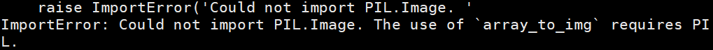
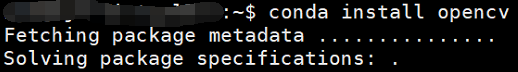
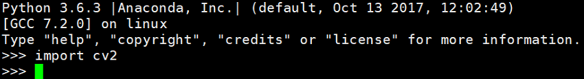

## **1、conda下载**

可以从清华大学镜像下载。地址是 <https://mirrors.tuna.tsinghua.edu.cn/help/anaconda/>

这里下载Miniconda。地址<https://mirrors.tuna.tsinghua.edu.cn/anaconda/miniconda/>

下载对应版本安装。

清华大学开源软件镜像站首页：<https://mirrors.tuna.tsinghua.edu.cn/>

## **2、添加第三方源**

TUNA 还提供了 Anaconda 仓库的镜像，运行以下命令:

conda config --add channels https://mirrors.tuna.tsinghua.edu.cn/anaconda/pkgs/main/

conda config --add channels https://mirrors.tuna.tsinghua.edu.cn/anaconda/pkgs/free/

conda config --set show_channel_urls yes

即可添加 Anaconda Python 免费仓库。

## **3、Conda 三方源**

**Conda Forge**

conda config --add channels https://mirrors.tuna.tsinghua.edu.cn/anaconda/cloud/conda-forge/

**msys2**

conda config --add channels https://mirrors.tuna.tsinghua.edu.cn/anaconda/cloud/msys2/

**bioconda**

conda config --add channels https://mirrors.tuna.tsinghua.edu.cn/anaconda/cloud/bioconda/

**menpo**

conda config --add channels https://mirrors.tuna.tsinghua.edu.cn/anaconda/cloud/menpo/

## **4、实例安装keras**

conda install keras

PIL包错误问题解决：



用pillow包替代。conda install pillow

## **5、conda安装opencv**

conda install opencv 默认安装即可



安装成功，在python环境下，import cv2验证。



也可指定源和版本
```bash
conda install -c  <https://conda.binstar.org/menpo>  opencv3=3.1.0
```

 

# **Conda简介**

Anaconda是一个Python下和Canopy类似的的科学计算环境，但用起来更加方便。自带的包管理器conda也很强大。

 

### Python科学计算环境conda的下载

 

Conda官方主页:   **https://github.com/conda/conda**

Conda官方下载地址:  [**Conda官方下载**](https://github.com/conda/conda/archive/master.zip)    

 我是x86_64 linux系统，所以下载 **https://repo.continuum.io/miniconda/Miniconda2-latest-Linux-x86_64.sh**

### miniconda的安装

- Miniconda下载

```
wget https://repo.continuum.io/miniconda/Miniconda2-latest-Linux-x86_64.sh
```

- 安装

```
sh Miniconda2-latest-Linux-x86_64.sh
```

输入yes，回车，输入yes，重新登录。

注意：安装完成后，conda下的bin文件会添加到环境变量里面，这时候需要source一下bash文件。

看到以下内容表示安装成功：

```
For this change to become active, you have to open a new terminal.

Thank you for installing Miniconda2!
```

- 试用

```
conda install numpy
```

 

###  miniconda的卸载

```bash
rm -rf ~/miniconda
```

修改~/.bash_profile中的环境变量，去除家目录中隐藏的.condarc文件.conda文件和.continuum目录：

```bash
rm -rf ~/.condarc ~/.conda ~/.continuum
```


## conda的使用

## 1.查看已经安装的包

  ```bash
conda list
  ```


## 2.查看可用软件包

 ```bash
conda search
 ```


## 3.安装软件包

```bash
conda install <package-name>
```
**注意:**

Anaconda提供了**Python2.7和Python3.4**两个版本，同时如果需要其他版本，还可以通过conda来创建。安装完成后可以看到，Anaconda提供了Spyder，IPython和一个命令行。下面来看一下conda。

输入 conda list 来看一下所有安装时自带的Python扩展。粗略看了一下，其中包括了常用的 Numpy , Scipy ， matplotlib 和 networkx 等，以及 beautiful-soup ， requests ， flask ， tornado 等网络相关的扩展。里边没有 sklearn ，所以首先装一下sklearn。

如果需要指定版本，也可以直接用 [package-name]=x.x 来指定。

conda的repo中的扩展不算太新，如果想要更新的，可能要用PyPI或者自己下载源码。而conda和pip关联的很好。使用pip安装的东西可以使用conda来管理，这点要比Canopy好。我对这个科学计算环境的另一个要求就是能够多个Python版本并存，尤其是2.x和3.x的并存。这个通过 virtualenv 可以做到。Anaconda也正是通过其实现的。

下面用conda创建一个名叫python2的版本为python2.7的环境。

 

这样就会在Anaconda安装目录下的envs目录下创建python2这个目录。直接用 conda install 并用 -n 指明安装到的环境，这里自然就是 python2 。

像 virtualenv 那样，先activate，然后在虚拟环境中安装。

 

## 如何用 conda 管理 Python 开发环境

 

### 1.创建（clone）新的环境

PS：\* 星号指示目前在哪个环境下。

 ```bash
conda env list
# conda environments:
root                  *  /home/rainy/.anaconda3

conda create --name nb --clone root

conda env list
# conda environments:
nb                       /home/rainy/.anaconda3/envs/nb
root                  *  /home/rainy/.anaconda3
 ```


### 2.切换环境：

 ```bash
source activate nb
# discarding /home/rainy/.anaconda3/bin from PATH
# prepending /home/rainy/.anaconda3/envs/nb/bin to PATH
 ```


此时变成 (nb) $ ，和 virtualenv 一样，只是在退出时不太一样：

```bash
which python/home/rainy/.anaconda3/envs/nb/bin/python
source deactivatediscarding /home/rainy/.anaconda3/envs/nb/bin from PATH
```

需要重新打开新的窗口才能再切换。现在查看已安装的 package 列表：

 ```bash
source active nb 
conda list
# packages in environment at /home/rainy/.anaconda3/envs/nb:
abstract-rendering           0.5.1               
np110py35_0alabaster         0.7.7                    
py35_0anaconda               2.5.0               
np110py35_0anaconda-client   1.2.2                    
py35_0argcomplete            1.0.0                    
py35_1astropy                1.1.1               
np110py35_0...
 ```

 

### 3.配置新的 Jupyter

Anaconda 已经集成了 Jupyter，可以直接使用。

Jupyter 默认的配置文件在 ~/.jupyter/jupyter_notebook_config.py ，新的 Jupyter 也会从这里读取配置文件，官方文档里面写的 jupyter {application} --generate-config 并不是想象中的用法：

 ```bash
jupyter app --generate-config
jupyter: 'app' is not a Jupiter command
 ```


根据 Google 的结果，应该是：

 ```bash
JUPYTER_CONFIG_DIR=./jupyter_config 
jupyter --generate-config
 ```

编辑配置：

 ```bash
vim ./jupyter_config/jupyter_notebook_config.py
c.NotebookApp.password = u'sha1:****'
c.NotebookApp.ip = 'my domain.com'
c.NotebookApp.port = 8888
 ```

启动：

```bash
JUPYTER_CONFIG_DIR=./jupyter_config 
jupyter notebook
```


## 删除环境

如果你不再使用某些环境，可以使用 `conda env remove -n env_name` 删除指定的环境（在这里名为 `env_name`）。

## 使用环境

对我帮助很大的一点是，我的 Python 2 和 Python 3 具有独立的环境。我使用了 `conda create -n py2 python=2` 和 `conda create -n py3 python=3` 创建两个独立的环境，即 `py2` 和 `py3`。现在，我的每个 Python 版本都有一个通用环境。在所有这些环境中，我都安装了大多数标准的数据科学包（numpy、scipy、pandas 等）。

我还发现，为我从事的每个项目创建环境很有用。这对于与数据不相关的项目（例如使用 Flask 开发的 Web 应用）也很有用。例如，我为我的个人博客（使用 [Pelican](http://docs.getpelican.com/en/stable/)）创建了一个环境。

## 共享环境

在 GitHub 上共享代码时，最好同样创建环境文件并将其包括在代码库中。这能让其他人更轻松地安装你的代码的所有依赖项。对于不使用 conda 的用户，我通常还会使用 `pip freeze`（[在此处了解详情](https://pip.pypa.io/en/stable/reference/pip_freeze/)）将一个 pip `requirements.txt` 文件导出并包括在其中。

## 了解更多信息

要详细了解 conda 以及它如何融入到 Python 生态系统中，请查看这篇由 Jake Vanderplas 撰写的文章：[Conda myths and misconceptions](https://jakevdp.github.io/blog/2016/08/25/conda-myths-and-misconceptions/)（有关 conda 的迷思和误解）。此外，如果你有空闲精力，也可以参考这篇 [conda 文档](http://conda.pydata.org/docs/using/index.html)。