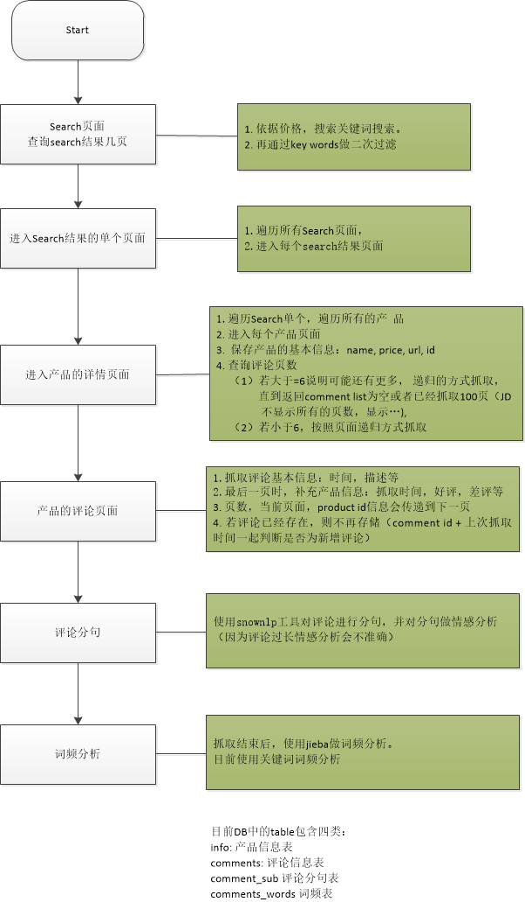

# 一、舆情分析-入门

## 入门简介

要做舆情分析首选需要有数据，然后做自然语言处理。

数据我们还是以python爬取为主，先从自然语言处理开始

## 自然语言入门

先了解下自然语言的基础知识

[FlySky1991的专栏 自然语言入门](http://blog.csdn.net/FlySky1991/article/category/6943294)

## 中文分词原理及分词工具介绍

### 中文分词概述

中文分词(Chinese Word Segmentation) 指的是将一个汉字序列切分成一个一个单独的词。分词就是将连续的字序列按照一定的规范重新组合成词序列的过程。

### 中文分词方法介绍

现有的分词方法可分为三大类：基于字符串匹配的分词方法、基于理解的分词方法和基于统计的分词方法。

### 常用工具

[自然语言处理入门（4）——中文分词原理及分词工具介绍](http://blog.csdn.net/flysky1991/article/details/73948971)

其中提到的几个常用工具：

1. jieba (github star数 9003)

   jieba分词是国内使用人数最多的中文分词工具（[github链接](https://github.com/fxsjy/jieba))。jieba分词支持三种模式：

   （1）精确模式：试图将句子最精确地切开，适合文本分析；

   （2）全模式：把句子中所有的可以成词的词语都扫描出来, 速度非常快，但是不能解决歧义；

   （3）搜索引擎模式：在精确模式的基础上，对长词再次切分，提高召回率，适合用于搜索引擎分词。

   jieba分词过程中主要涉及如下几种算法：

   （1）基于前缀词典实现高效的词图扫描，生成句子中汉字所有可能成词情况所构成的有向无环图 (DAG)；

   （2）采用了动态规划查找最大概率路径, 找出基于词频的最大切分组合；

   （3）对于未登录词，采用了基于汉字成词能力的 HMM 模型，采用Viterbi 算法进行计算；

   （4）基于Viterbi算法做词性标注；

   （5）基于tf-idf和textrank模型抽取关键词；

2. SnowNLP(github star数 2043)

   SnowNLP是一个python写的类库，可以方便的处理中文文本内容，是受到了TextBlob的启发而写的。SnowNLP主要包括如下几个功能：

   （1）中文分词（Character-Based Generative Model）；

   （2）词性标注（3-gram HMM）；

   （3）情感分析（简单分析，如评价信息）；

   （4）文本分类（Naive Bayes）

   （5）转换成拼音（Trie树实现的最大匹配）

   （6）繁简转换（Trie树实现的最大匹配）

   （7）文本关键词和文本摘要提取（TextRank算法）

   （8）计算文档词频（TF，Term Frequency）和逆向文档频率（IDF，Inverse Document Frequency）

   （9）Tokenization（分割成句子）

   （10）文本相似度计算（BM25）

   SnowNLP的最大特点是特别容易上手，用其处理中文文本时能够得到不少有意思的结果，但不少功能比较简单，还有待进一步完善。

3. THULAC (github star数 311)

   THULAC（THU Lexical Analyzer for Chinese）由清华大学自然语言处理与社会人文计算实验室研制推出的一套中文词法分析工具包（[github链接](https://github.com/thunlp/THULAC-Python)），具有中文分词和词性标注功能。THULAC具有如下几个特点：

   （1）能力强。利用我们集成的目前世界上规模最大的人工分词和词性标注中文语料库（约含5800万字）训练而成，模型标注能力强大。

   （2）准确率高。该工具包在标准数据集Chinese Treebank（CTB5）上分词的F1值可达97.3％，词性标注的F1值可达到92.9％，与该数据集上最好方法效果相当。

   （3）速度较快。同时进行分词和词性标注速度为300KB/s，每秒可处理约15万字。只进行分词速度可达到1.3MB/s。

4. NLPIR (github star数 811)

   NLPIR分词系统（前身为2000年发布的ICTCLAS词法分析系统，[gtihub链接](https://github.com/NLPIR-team/NLPIR)），是由北京理工大学张华平博士研发的中文分词系统

   经过十余年的不断完善，拥有丰富的功能和强大的性能。

   NLPIR是一整套对原始文本集进行处理和加工的软件，提供了中间件处理效果的可视化展示，也可以作为小规模数据的处理加工工具。

   主要功能包括：中文分词，词性标注，命名实体识别，用户词典、新词发现与关键词提取等功能。

   PyNLPIR（NLPIR的Python版本，[github链接](https://github.com/tsroten/pynlpir)）

除了这些之外，还有:

[语义分析：语言云（语言技术平台云）哈工大联合讯飞推出](https://www.ltp-cloud.com/demo/)

## 实践工具选择

因为我们的目的是做舆情分析，因此重点是对评价文字做情感词性的分析。

工具主要选用[snownlp](https://pypi.python.org/pypi/snownlp/)

库的使用有参看下面几篇文章：

- [自然语言处理入门（2）——中文文本处理利器snownlp](http://blog.csdn.net/FlySky1991/article/details/72824461)
- [python的中文文本挖掘库snownlp进行购物评论文本情感分析实例](http://blog.csdn.net/yyxyyx10/article/details/62428238)
- [snownlp文本情感分析使用，使用自定义训练库](http://blog.csdn.net/u011961856/article/details/54573517)

## Reference

- [使用Python的SnowNLP模块实现情感分析](http://blog.csdn.net/iqqiqqiqqiqq/article/details/50756552)
- [基于机器学习的NLP情感分析](http://blog.csdn.net/stary_yan/article/details/75313259)
- [Python 自然语言处理（NLP）工具库汇总](http://python.jobbole.com/81834/)
- [知乎 如何用 Python 中的 NLTK 对中文进行分析和处理？](https://www.zhihu.com/question/20922994)
- [python库使用整理](https://www.cnblogs.com/sweetyu/p/6863560.html)
- [中文分词项目(开源/API接口)总结](http://blog.csdn.net/wwjiang_ustc/article/details/50383423)
- [科大讯飞的语义API](http://blog.csdn.net/waidazhengzhao/article/details/53889020)
- [WordArt词频分析工具](https://wordart.com/create)
- [如何用Python做情感分析？](http://www.jianshu.com/p/d50a14541d01)


# 二、舆情分析-jieba分词

## 环境

python 2.7 + pycharm, windows 环境

python已经抓取了评论数据

## [jieba分词](https://github.com/fxsjy/jieba)

jieba“结巴”中文分词：使用很广的一个分词组件

支持三种分词模式：

- 精确模式，试图将句子最精确地切开，适合文本分析；
- 全模式，把句子中所有的可以成词的词语都扫描出来, 速度非常快，但是不能解决歧义；
- 搜索引擎模式，在精确模式的基础上，对长词再次切分，提高召回率，适合用于搜索引擎分词。

因为我们要做文本分析，因此我使用默认的精确模式。

```python
words_ls = jieba.cut(content)
```

## 词频统计

词频统计有很多中方法，比如jieba的extract tags, textrank, collections, nltk, pandas, WordCloud等

以下是几种方法的演示

Code中的词频方法说明：

- jieba extract_tags 提取关键词，获取结果是 (word, float)
- jieba textrank 提取摘要 获取结果是(word, float)
- collections获取结果 (word, int)
- jieba & nltk获取结果 (word, int)

### Code

```python
# -*- coding: utf-8 -*-

import re

# sys print config
import sys
reload(sys)
sys.setdefaultencoding('utf-8')
import uniout

# nlp
import jieba
# 自定义词典
jieba.load_userdict("jieba_dict.txt")
import jieba.analyse
import nltk
import collections

def main():
    list = ["好大一只！",
            "给母亲买的，希望关键时刻，小布可以给独居的老人可以和我们儿女联系上，所以大家都很期待，今天货一到，我立马送去母亲家安装。特把体验发给大家分享：外形和尺寸感觉不错，语音识别度不高，自己找不到回去充电的路径，拍五下后求救功能竟然没用，机器人显示求救信号发出，我手机没有收到任何信号，感觉非常失望",
            "外观很漂亮，京东配送也很好。只是小布语音识别率太低了，而且孩子学习，游戏内容太少，一句话感觉是买了个初级产品。已退货。",
            "很好的小布"]
    topK = 20

    FILE_NAME = 'analysis.txt'
    RESULT_NAME = 'result.txt'
    analysis_file = open(FILE_NAME, 'w')

    for each in list:
        analysis_file.write(each.strip())
    analysis_file.close()

    # analysis
    content = open(FILE_NAME, 'rb').read()
    # 去除文本中的中文符号和英文符号
    content = content.decode("utf8")
    content = re.sub("[\s+\.\!\：\/_,$%^*(+\"\']+|[+——！，。？?、~@#￥%……&*（）]+".decode("utf8"), "".decode("utf8"), content)

    # 1. --- analysis with jieba extract_tags. (word, float)
    data = jieba.analyse.extract_tags(content, topK=topK, withWeight=True)
    with open("result_jieba_tags.txt", 'w') as fw:
        for k, v in data:
            fw.write("%s,%f\n" % (k, v))

    # 2. analysis jieba textrank. (word, float)
    data = jieba.analyse.textrank(content, topK=topK, withWeight=True, allowPOS=('ns', 'n', 'vn', 'v'))
    with open("result_jieba_rank.txt", 'w') as fw:
        for k, v in data:
            fw.write("%s,%f\n" % (k, v))

    # 3. --- analysis with jieba & collections. (word, int)
    words_ls = jieba.cut(content)
    data = dict(collections.Counter(words_ls))
    sort_dict = sorted(data.iteritems(), key=lambda d: d[1], reverse=True)
    with open("result_collect.txt", 'w') as fw:
        for k, v in sort_dict:
            fw.write("%s,%d\n" % (k.encode('utf-8'), v))

    # 4. --- analysis with jieba & nltk. (word, int) 
    words_ls = jieba.cut(content)
    fd = nltk.FreqDist(words_ls)
    keys = fd.keys()
    item = fd.iteritems()
    dicts = dict(item)
    sort_dict = sorted(dicts.iteritems(), key=lambda d: d[1], reverse=True)
    with open("result_nltk.txt", 'w') as fw:
        for k, v in sort_dict:
            fw.write("%s,%d\n" % (k.encode('utf-8'), v))

if __name__ == '__main__':
    main()

```

## Reference

- [通过用户自定义词典来增强歧义纠错能力](https://github.com/fxsjy/jieba/issues/14)
- [py库： jieba （中文词频统计） 、collections （字频统计）、WordCloud （词云）](https://www.cnblogs.com/qq21270/p/7695275.html)


# 三、舆情分析 - snownlp实战Zenbo评论分析

## 环境

python 2.7 + pycharm, windows 环境

python已经抓取了评论数据

## 情感分析

思路，先将每句话分句，然后对每个短句做情感分析。因为评论有些会很长，如果整句做分析，识别率会降低。

Code：

```python
# -*- coding: utf-8 -*-
"""
SnowNLP for zenbo comments
"""

from snownlp import SnowNLP
import sys
reload(sys)
sys.setdefaultencoding('utf-8')

def main():
    list = [u'昨天收到还在研究 腾讯微小云竟然还没上架 也是醉了',
            u'做工精细，还是比较符合我的期望，就是知道台湾才卖599美金，再次感受被歧视啦',
            u'很好的机器人功能很多.',
            u'很好的，家里小孩很喜欢，赞一个新科技产品',
            u'不错哟，功能很多，喜欢',
            u'新产品值得尝试，抱着一颗容错的心吧',
            u'充电的时候怎么自己就开机了，不用我开电源，是不是激活了',
            u'终于到货了，机器人比较萌，按说明书配置时发现但广告重点的腾讯云小微AI敢情还没上线，等于订购的是一个纯华硕产品。而在之前的腾讯推广和厂商京东官网事先均没有任何提示，等于预售了一个半成品，客服说月底上线，按时间算，万一等月底上线测试不满意客观上造成七天无理由退货条件就不能符合了。测了下华硕原生部分，单从语音识别和简单AI看，糟点还挺多，先耐心等待，让小朋友来进行自主测试吧。',
            u'很不错的机器人！',
            u'产品严重跟宣传不符 1.系统反应缓慢，经常语音识别错误；\
            2.产品避障功能很差，智能跟随居然会卡在床角或者沙发角，讲故事的时候小朋友离得太近机器人撞到小朋友不会躲避，我女儿都被吓哭了；\
            3.宣传的老人监护功能说是台湾版本才有，还要搭配华硕的手表才有用，而且要手动按键才有用，演示的时候说有人晕倒就会自动报警，如果要手动何必要这个机器人？\
            4.可以播放的故事很少，要播视频还要安装小微，小微还是个不全面的版本，无语！\
            5.产品是硬塑料做的，链接处和机器人脖子的地方有很多锋利的毛刺，摄像头拍照不清晰，连和面板的位置都对不准，完全怀疑是个半程品的工程样机！\
            缺点很多，总之这次对华硕的产品很失望！',
            u'好大一只！',
            u'给母亲买的，希望关键时刻，小布可以给独居的老人可以和我们儿女联系上，所以大家都很期待，今天货一到，我立马送去母亲家安装。特把体验发给大家分享：外形和尺寸感觉不错，语音识别度不高，自己找不到回去充电的路径，拍五下后求救功能竟然没用，机器人显示求救信号发出，我手机没有收到任何信号，感觉非常失望',
            u'外观很漂亮，京东配送也很好。只是小布语音识别率太低了，而且孩子学习，游戏内容太少，一句话感觉是买了个初级产品。已退货。',
            u'用了一段时间了，说说感受，因为无法在购买之前在实体店体验，对他的认知只能通过网上的宣传视频获取，所以起初对这款机器人的期望值过高，而在使用过程中逐渐发现不足，首先，机器人的“听觉”不灵敏，好多时候在屋内安静的情况下还需要反复几次的呼唤指令，得到确认后才能进行下一步的操作，语音指令不能修改，总是需要反复的“嗨小布”或“嗨zenbo”，几次过后自己都嫌烦，智能程度相当有限，只能通过指定的口令进行操作，换了其中某个字都无法执行，配套的功能还有待大幅度的完善，现在能与孩子互动的故事只有三个，而能玩的游戏也不过四五个，再加之其智能程度的缺陷，现在家里基本算是摆设，没办法，既然买了，只能期待未来能有更多的功能给予增加和完善吧',
            u'奔着AI人工智能去买的，不够智能，熟悉环境能力差，还要人手工标注，好了以后，进房间后，怎么都出不去，直接在那里面壁思过，不动了，叫他做别的事情，他居然还说正在任务，不执行，坑，比计算机还烂，计算机还多线程处理，多任务处理，就是一个会跑的玩具，不值！',
            u'非常不好使，搞了半天没搞出名堂，打电话没人来指导，不如一千块的智能机器人！',
            u'相信华硕的品牌，结果很失望，超级难用，纯粹还是个半成品，就玩具的水准，希望后续能升级改进，',
            u'昨天收到还在研究 腾讯微小云竟然还没上架 也是醉了',
            u'很好的机器人功能很多.',
            u'不错哟，功能很多，喜欢']
    pos = 1;
    for each in list:
        s = SnowNLP(each)
        sens = s.sentences
        print("----- " + str(pos))
        for sentence in sens:
            print("** " + sentence)
            s2 = SnowNLP(sentence)
            print( "情感词性为正的概率: " + str(s2.sentiments) + "\r\n")
        pos = pos + 1

if __name__ == '__main__':
    main()

```

输出结果：

```python
----- 1
** 昨天收到还在研究 腾讯微小云竟然还没上架 也是醉了
情感词性为正的概率: 0.187974944249

----- 2
** 做工精细
情感词性为正的概率: 0.964702989744

** 还是比较符合我的期望
情感词性为正的概率: 0.421874184535

** 就是知道台湾才卖599美金
情感词性为正的概率: 0.981010924358

** 再次感受被歧视啦
情感词性为正的概率: 0.48344070147

----- 3
** 很好的机器人功能很多.
情感词性为正的概率: 0.937274275583

----- 4
** 很好的
情感词性为正的概率: 0.778637445267

** 家里小孩很喜欢
情感词性为正的概率: 0.916894572818

** 赞一个新科技产品
情感词性为正的概率: 0.980180647403

----- 5
** 不错哟
情感词性为正的概率: 0.861519607843

** 功能很多
情感词性为正的概率: 0.839826047345

** 喜欢
情感词性为正的概率: 0.698043184885

----- 6
** 新产品值得尝试
情感词性为正的概率: 0.897589714131

** 抱着一颗容错的心吧
情感词性为正的概率: 0.878459849966

----- 7
** 充电的时候怎么自己就开机了
情感词性为正的概率: 0.20447353124

** 不用我开电源
情感词性为正的概率: 0.256078352985

** 是不是激活了
情感词性为正的概率: 0.261593072763

----- 8
** 终于到货了
情感词性为正的概率: 0.518290675734

** 机器人比较萌
情感词性为正的概率: 0.759058763169

** 按说明书配置时发现但广告重点的腾讯云小微AI敢情还没上线
情感词性为正的概率: 0.659650513298

** 等于订购的是一个纯华硕产品
情感词性为正的概率: 0.416299551274

** 而在之前的腾讯推广和厂商京东官网事先均没有任何提示
情感词性为正的概率: 0.0287118404658

** 等于预售了一个半成品
情感词性为正的概率: 0.0719724821311

** 客服说月底上线
情感词性为正的概率: 0.022113265448

** 按时间算
情感词性为正的概率: 0.587797157042

** 万一等月底上线测试不满意客观上造成七天无理由退货条件就不能符合了
情感词性为正的概率: 0.0052479368543

** 测了下华硕原生部分
情感词性为正的概率: 0.705926935417

** 单从语音识别和简单AI看
情感词性为正的概率: 0.610011986602

** 糟点还挺多
情感词性为正的概率: 0.755808137665

** 先耐心等待
情感词性为正的概率: 0.574086194065

** 让小朋友来进行自主测试吧
情感词性为正的概率: 0.933655574206

----- 9
** 很不错的机器人
情感词性为正的概率: 0.911762490324

----- 10
** 产品严重跟宣传不符 1.系统反应缓慢
情感词性为正的概率: 0.0226630532354

** 经常语音识别错误
情感词性为正的概率: 0.587702212024

** 2.产品避障功能很差
情感词性为正的概率: 0.310996921999

** 智能跟随居然会卡在床角或者沙发角
情感词性为正的概率: 0.441072349453

** 讲故事的时候小朋友离得太近机器人撞到小朋友不会躲避
情感词性为正的概率: 0.977089857469

** 我女儿都被吓哭了
情感词性为正的概率: 0.897638406035

** 3.宣传的老人监护功能说是台湾版本才有
情感词性为正的概率: 0.524999503317

** 还要搭配华硕的手表才有用
情感词性为正的概率: 0.0671161460286

** 而且要手动按键才有用
情感词性为正的概率: 0.171277452698

** 演示的时候说有人晕倒就会自动报警
情感词性为正的概率: 0.0147276406994

** 如果要手动何必要这个机器人
情感词性为正的概率: 0.322763226408

** 4.可以播放的故事很少
情感词性为正的概率: 0.78364409691

** 要播视频还要安装小微
情感词性为正的概率: 0.375978501338

** 小微还是个不全面的版本
情感词性为正的概率: 0.685647994563

** 无语
情感词性为正的概率: 0.364107301129

** 5.产品是硬塑料做的
情感词性为正的概率: 0.0748379729647

** 链接处和机器人脖子的地方有很多锋利的毛刺
情感词性为正的概率: 0.624989403226

** 摄像头拍照不清晰
情感词性为正的概率: 0.714883630007

** 连和面板的位置都对不准
情感词性为正的概率: 0.566373838953

** 完全怀疑是个半程品的工程样机
情感词性为正的概率: 0.206895809495

** 缺点很多
情感词性为正的概率: 0.661043412027

** 总之这次对华硕的产品很失望
情感词性为正的概率: 0.472289106801

----- 11
** 好大一只
情感词性为正的概率: 0.592297471465

----- 12
** 给母亲买的
情感词性为正的概率: 0.891154618531

** 希望关键时刻
情感词性为正的概率: 0.78243848677

** 小布可以给独居的老人可以和我们儿女联系上
情感词性为正的概率: 0.741515486521

** 所以大家都很期待
情感词性为正的概率: 0.8188973353

** 今天货一到
情感词性为正的概率: 0.352525252525

** 我立马送去母亲家安装
情感词性为正的概率: 0.528516977589

** 特把体验发给大家分享：外形和尺寸感觉不错
情感词性为正的概率: 0.993613535921

** 语音识别度不高
情感词性为正的概率: 0.477761247876

** 自己找不到回去充电的路径
情感词性为正的概率: 0.0779890045608

** 拍五下后求救功能竟然没用
情感词性为正的概率: 0.338759308472

** 机器人显示求救信号发出
情感词性为正的概率: 0.111047151624

** 我手机没有收到任何信号
情感词性为正的概率: 0.252127745614

** 感觉非常失望
情感词性为正的概率: 0.165985349827

----- 13
** 外观很漂亮
情感词性为正的概率: 0.992317477595

** 京东配送也很好
情感词性为正的概率: 0.732267012555

** 只是小布语音识别率太低了
情感词性为正的概率: 0.164669302396

** 而且孩子学习
情感词性为正的概率: 0.937989901518

** 游戏内容太少
情感词性为正的概率: 0.39168821257

** 一句话感觉是买了个初级产品
情感词性为正的概率: 0.546322772896

** 已退货
情感词性为正的概率: 0.0957972147762

----- 14
** 用了一段时间了
情感词性为正的概率: 0.71055722488

** 说说感受
情感词性为正的概率: 0.717616580311

** 因为无法在购买之前在实体店体验
情感词性为正的概率: 0.665721791972

** 对他的认知只能通过网上的宣传视频获取
情感词性为正的概率: 0.271954315781

** 所以起初对这款机器人的期望值过高
情感词性为正的概率: 0.948133400831

** 而在使用过程中逐渐发现不足
情感词性为正的概率: 0.751229213985

** 首先
情感词性为正的概率: 0.526284957465

** 机器人的“听觉”不灵敏
情感词性为正的概率: 0.0991246137991

** 好多时候在屋内安静的情况下还需要反复几次的呼唤指令
情感词性为正的概率: 0.81358935977

** 得到确认后才能进行下一步的操作
情感词性为正的概率: 0.142182560129

** 语音指令不能修改
情感词性为正的概率: 0.445681017067

** 总是需要反复的“嗨小布”或“嗨zenbo”
情感词性为正的概率: 0.0287604930079

** 几次过后自己都嫌烦
情感词性为正的概率: 0.349114695913

** 智能程度相当有限
情感词性为正的概率: 0.593224861815

** 只能通过指定的口令进行操作
情感词性为正的概率: 0.242771372511

** 换了其中某个字都无法执行
情感词性为正的概率: 0.275627710401

** 配套的功能还有待大幅度的完善
情感词性为正的概率: 0.454117022948

** 现在能与孩子互动的故事只有三个
情感词性为正的概率: 0.935295451541

** 而能玩的游戏也不过四五个
情感词性为正的概率: 0.575125501569

** 再加之其智能程度的缺陷
情感词性为正的概率: 0.270431314047

** 现在家里基本算是摆设
情感词性为正的概率: 0.680354690444

** 没办法
情感词性为正的概率: 0.111815459495

** 既然买了
情感词性为正的概率: 0.508899849882

** 只能期待未来能有更多的功能给予增加和完善吧
情感词性为正的概率: 0.97826035617

----- 15
** 奔着AI人工智能去买的
情感词性为正的概率: 0.668053416165

** 不够智能
情感词性为正的概率: 0.545454545455

** 熟悉环境能力差
情感词性为正的概率: 0.629568298598

** 还要人手工标注
情感词性为正的概率: 0.207289109114

** 好了以后
情感词性为正的概率: 0.655911843542

** 进房间后
情感词性为正的概率: 0.205518108568

** 怎么都出不去
情感词性为正的概率: 0.410207995348

** 直接在那里面壁思过
情感词性为正的概率: 0.771228745788

** 不动了
情感词性为正的概率: 0.30809853802

** 叫他做别的事情
情感词性为正的概率: 0.615610520069

** 他居然还说正在任务
情感词性为正的概率: 0.1658077489

** 不执行
情感词性为正的概率: 0.39997217995

** 坑
情感词性为正的概率: 0.0967741935484

** 比计算机还烂
情感词性为正的概率: 0.705908027763

** 计算机还多线程处理
情感词性为正的概率: 0.824212206726

** 多任务处理
情感词性为正的概率: 0.526284957465

** 就是一个会跑的玩具
情感词性为正的概率: 0.773534861997

** 不值
情感词性为正的概率: 0.186440677966

----- 16
** 非常不好使
情感词性为正的概率: 0.379577301506

** 搞了半天没搞出名堂
情感词性为正的概率: 0.0150211378754

** 打电话没人来指导
情感词性为正的概率: 0.246396162712

** 不如一千块的智能机器人
情感词性为正的概率: 0.480352959119

----- 17
** 相信华硕的品牌
情感词性为正的概率: 0.839572516899

** 结果很失望
情感词性为正的概率: 0.251370998346

** 超级难用
情感词性为正的概率: 0.443093669513

** 纯粹还是个半成品
情感词性为正的概率: 0.159834867941

** 就玩具的水准
情感词性为正的概率: 0.737702785892

** 希望后续能升级改进
情感词性为正的概率: 0.788609598605

----- 18
** 昨天收到还在研究 腾讯微小云竟然还没上架 也是醉了
情感词性为正的概率: 0.187974944249

----- 19
** 很好的机器人功能很多.
情感词性为正的概率: 0.937274275583

----- 20
** 不错哟
情感词性为正的概率: 0.861519607843

** 功能很多
情感词性为正的概率: 0.839826047345

** 喜欢
情感词性为正的概率: 0.698043184885

```

## 结果分析

个人建议若整句概率大于60%可以作为正面评价；若整句中有一个短句低于20%（可以视情况调整）可以作为负面评价；其他可算作中评。

## Reference

- [如何用Python做情感分析？](http://www.jianshu.com/p/d50a14541d01)


# 四、舆情分析 - JD数据翻页抓取

## JD数据翻页抓取

前面已经做到评论分页抓取。但是JD搜索出的产品通常不止一页，我们也要对产品进行分页获取。

然后在对每个产品进行分页抓取评论。

## 实践

index_page： 在这里进行搜索分页判断，如果有多个页面就 for i in range(1, int(page)) 来循环抓取
detail_page： 这里是详情页面，跟之前的相比，优化了评论页数的判断。因为JD评论大于6页，会出现…无法获取全部的页数。 
如果小于6页，就循环抓取 ： comment_page
如果大于6页，就采用递归的方式。直到获取出的list为空，或者是已经到了最大100页面（JD展示maxpage是100页）： comment_circle_page
Code：


```python
#!/usr/bin/env python
# -*- encoding: utf-8 -*-
# Created on 2017-12-28 10:48:50
# Project: NB_U_JD

from pyspider.libs.base_handler import *
import re
import json

# sys print config
import sys

reload(sys)
sys.setdefaultencoding('utf-8')
import uniout

# user class import
sys.path.append(unicode("F:\\Manager\\大数据\\Code\\localgit\\python", "utf-8"))
import utils.tool
import db.notebookdb


class Handler(BaseHandler):
    crawl_config = {
        "headers": {
            "user-agent": "Mozilla/5.0 (Windows NT 10.0; WOW64) AppleWebKit/537.36 (KHTML, like Gecko) Chrome/55.0.2883.87 Safari/537.36"
        }
    }

    # debug, True:save local db; otherwise save to remote db
    DEBUG = True
    
    def __init__(self):
        # 搜索：华硕顽石畅玩版R414UV，按照价格排序,3000以上
        search_word = "华硕顽石畅玩版R414UV"
        price = "3000"
        self.url = 'https://search.jd.com/Search?keyword=' + search_word + '&enc=utf-8&wq=' + search_word + '&ev=exprice_' + price + 'gt%5E&psort=1&click=0'
        # comment url
        self.comment_url = "https://sclub.jd.com/comment/productPageComments.action?productId="
        # 翻页 url
        self.turnpage_url = self.url + '&page='
        # key word
        self.keyword = "顽石畅玩版R414UV"
        # product name
        self.productName = "顽石畅玩版R414UV"
        self.tool = utils.tool.Tool()
        self.mysql = db.notebookdb.MySQLDBHelp(Handler.DEBUG)
    
    TIME = 12 * 60  # 抓取频率, 有效期 (/分)
    
    @every(minutes=TIME)  # 每小时
    def on_start(self):
        self.crawl(self.url, callback=self.index_page, validate_cert=False)
    
    # 搜索出的列表页面
    @config(age=TIME * 60)
    @config(priority=4)
    def index_page(self, response):
        page = response.doc('em > b').text()
        if self.tool.isFloat(page) and float(page) > 1:
            print "search has multi pages ", page
            for i in range(1, int(page)):
                num = i * 2 - 1
                turn_page = self.turnpage_url + str(i)
                print turn_page
                self.crawl(turn_page, callback=self.turn_page, validate_cert=False, fetch_type='js')
        else:
            print "search has one page"
            turn_page = self.turnpage_url + "1"
            self.crawl(turn_page, callback=self.turn_page, validate_cert=False, fetch_type='js')
    
    # 搜索翻页页面
    @config(age=TIME * 60)
    @config(priority=3)
    def turn_page(self, response):
        list = response.doc('.J-goods-list > .clearfix >li')
        for each in list.items():
            name = each.find('.p-name-type-2 em').text()
            price = float(each.find('div > div.p-price > strong > i').text())
            if self.keyword in name:
                detail_url = each.find('.p-commit > strong > a').attr("href")
                print "product:", price, ",", detail_url
                self.crawl(detail_url, callback=self.detail_page, validate_cert=False, fetch_type='js')
    
    @config(age=TIME * 60)
    @config(priority=2)
    def detail_page(self, response):
        # 获取评论的页数
        pages = response.doc('div.com-table-footer > div > div >a')
        if pages:
            # check if there are some pages and set max page number 100
            num = self.getVisiableNumber(pages.items())
            productId = re.findall("/\d+.html", response.url)[0]
            productId = re.findall("\d+", productId)[0]
            print "productId, visiable num: ", productId, ",", num
            if num >= 6:  # 超过6页会有...无法计算准确页面，采用递归方式获取
                # set first comment page url
                multi_url = self.comment_url + productId + "&score=0&sortType=5&page=0&pageSize=10&isShadowSku=0&rid=0&fold=1"
                self.crawl(multi_url, callback=self.comment_circle_page, validate_cert=False, fetch_type='js',
                           save={'page': 1})
            elif num > 0:  # 小于6页，采用循环的形式获取
                isLastPage = False
                for i in range(0, num):
                    multi_url = self.comment_url + productId + "&score=0&sortType=5&page=" + str(
                        i) + "&pageSize=10&isShadowSku=0&rid=0&fold=1"
                    print multi_url
                    if i == num - 1:
                        isLastPage = True
                    self.crawl(multi_url, callback=self.comment_page, validate_cert=False, fetch_type='js',
                               save={'isLastPage': isLastPage})
    
        return {
            "url": response.url,
            "title": response.doc('title').text(),
        }
    
    # get visiable number in detail page
    def getVisiableNumber(self, pages):
        list = []
        list.append(0)
        for each in pages:
            numstr = each.text()
            if numstr.isdigit():
                num = int(numstr)
                list.append(num)
        return max(list)
    
    # we get comments through json api
    @config(age=TIME * 60)
    @config(priority=1)
    def comment_page(self, response):
        try:
            # json parse
            jsonstr = response.doc("body").text()
            hjson = json.loads(jsonstr)
            comments = hjson["comments"]
            summary = hjson["productCommentSummary"]
            productId = summary['productId']
            # comments list infomation
            commentslist = []
            for each in comments:
                time_int = self.tool.dateTimeToInt(each["creationTime"])
                data = (productId, each["id"], each["nickname"], time_int, each["score"],
                        each["userLevelName"], each['userImgFlag'], each["content"])
                commentslist.append(data)
    
            # write comments to db
            self.write_comments(commentslist, productId)
    
            isLastPage = response.save.get('isLastPage')
            # if last page, write product info summary to db
            if isLastPage:
                print "is last page, write product info"
                # summary infomation
                dict_sum = {}
                dict_sum['productId'] = productId
                dict_sum['goodCount'] = summary['goodCount']
                dict_sum['generalCount'] = summary['generalCount']
                dict_sum['poorCount'] = summary['poorCount']
                self.write_product(dict_sum)
        except Exception, e:
            print "comment_page ex ", e
    
        return {
            "url": response.url,
        }
    
    # we get comments through json api
    @config(age=TIME * 60)
    @config(priority=1)
    def comment_circle_page(self, response):
        try:
            page = response.save.get('page')
            print "it's the page ", page
            # json parse
            jsonstr = response.doc("body").text()
            hjson = json.loads(jsonstr)
            comments = hjson["comments"]
            summary = hjson["productCommentSummary"]
            # comments list infomation
            productId = summary['productId']
            commentslist = []
            commentsIds = []
            for each in comments:
                time_int = self.tool.dateTimeToInt(each["creationTime"])
                data = (productId, each["id"], each["nickname"], time_int, each["score"],
                        each["userLevelName"], each['userImgFlag'], each["content"])
                commentslist.append(data)
                commentsIds.append(each["id"])
    
            # save comments
            if len(commentsIds) == 0 or page == 100:  # it's the last page, write product in db
                print "it's the last page, write product in db"
                dict_sum = {}
                dict_sum['productId'] = productId
                dict_sum['goodCount'] = summary['goodCount']
                dict_sum['generalCount'] = summary['generalCount']
                dict_sum['poorCount'] = summary['poorCount']
                self.write_product(dict_sum)
            else:
                # write comments to db
                self.write_comments(commentslist, productId)
                # goto next page
                page = page + 1
                multi_url = self.comment_url + str(productId) + "&score=0&sortType=5&page=" + str(
                    page) + "&pageSize=10&isShadowSku=0&rid=0&fold=1"
                self.crawl(multi_url, callback=self.comment_circle_page, validate_cert=False, fetch_type='js',
                           save={'page': page})
        except Exception, e:
            print "comment_circle_page ex ", e
            # goto next page
            page = page + 1
            multi_url = self.comment_url + str(productId) + "&score=0&sortType=5&page=" + str(
                page) + "&pageSize=10&isShadowSku=0&rid=0&fold=1"
            self.crawl(multi_url, callback=self.comment_circle_page, validate_cert=False, fetch_type='js',
                       save={'page': page})
    
        return {
            "url": response.url,
        }
    
    # query comment exist or not
    def write_product(self, dict_sum):
        dict_sum['productName'] = self.productName
        dict_sum['updatetime'] = self.tool.getCurrentIntTime()
        self.mysql.insert_product(dict_sum)
    
        # write product info to db
    
    def write_product(self, dict_sum):
        dict_sum['productName'] = self.productName
        dict_sum['updatetime'] = self.tool.getCurrentIntTime()
        self.mysql.insert_product(dict_sum)
    
        # write to db
    
    def write_comments(self, commentslist, productId):
        self.mysql.insert_comments(commentslist, productId)

```

# 五、舆情分析 - JD数据抓取优化

## JD数据抓取优化

我们期望是在文件中指定制定产品信息和表名，程序可以依据这些信息自动抓取到对应的表中。

## 方案

我们的想法是：

- 定义config.json文件存放产品信息和表名
- PySpider Project文件负责定时抓取
- 封装Operation基类负责解析网页和存储

### 1. config.json

config文件信息如下：

```shell
{
  "configs": [
    {
      "index": 0,
      "search_word": "小米air13.3",
      "price": "4000",
      "productName": "小米(MI)Air 13.3英寸全金属轻薄笔记本",
      "keyword": "13.3",
      "tables": [
        "compete_info",
        "compete_comments",
        "compete_comments_sub",
        "compete_comments_words"
      ]
    }
  ]
}
```

### 2. Operation基类

核心Code如下：

```python
def index_page(self, client, response):
    page = response.doc('.fp-text > i').text()
    print "search total page:", page
    for i in range(1, int(page) + 1):
        num = i * 2 - 1
        turn_page = self.turnpage_url + str(i)
        print "search page index:", i, ",", turn_page
        client.crawl(turn_page, callback=client.turn_page, validate_cert=False, fetch_type='js')

def turn_page(self, client, response):
    plist = response.doc('.J-goods-list > .clearfix >li')
    index = 1
    for each in plist.items():
        name = each.find('.p-name-type-2 em').text()
        if self.keyword in name:
            detail_url = each.find('.p-commit > strong > a').attr("href")
            print "product index:", index, ",url", detail_url
            index = index + 1
            client.crawl(detail_url, callback=client.detail_page, validate_cert=False, fetch_type='js')

def detail_page(self, client, response):
    # 获取评论的页数
    pages = response.doc('div.com-table-footer > div > div >a')
    productId = re.findall("/\d+.html", response.url)[0]
    productId = re.findall("\d+", productId)[0]
    if pages:
        # check if there are some pages and set max page number 100
        page = self.getVisiableNumber(pages.items())
        print "productId:", productId, ",visible comment page:", page
        # write part product info to db
        dict = {}
        dict['productName'] = self.productName
        dict['productId'] = productId
        dict['displayName'] = response.doc('.sku-name').text()
        dict['detailUrl'] = response.url
        dict['price'] = response.doc('.p-price > span').eq(1).text()
        self.add_product(dict)
        if page >= 6:  # 超过6页会有...无法计算准确页面，采用递归方式获取
            # set first comment page url
            multi_url = self.comment_url + productId + "&score=0&sortType=5&page=0&pageSize=10&isShadowSku=0&rid=0&fold=1"
            client.crawl(multi_url, callback=client.comment_circle_page, validate_cert=False, fetch_type='js',
                         save={'page': 0, 'productId': productId})
        elif page > 0:  # 小于6页，依据页数，采用递归方式获取
            multi_url = self.comment_url + productId + "&score=0&sortType=5&page=0&pageSize=10&isShadowSku=0&rid=0&fold=1"
            client.crawl(multi_url, callback=client.comment_page, validate_cert=False, fetch_type='js',
                         save={'page': page, 'pos': 0, 'productId': productId})
    else:
        print "productId:", productId, ",no comments"

def comment_page(self, client, response):
    try:
        # get page position information
        page = response.save.get('page')
        productId = response.save.get('productId')
        pos = int(response.save.get('pos'))
        print "total page:", page, "current page index:", pos, ",", response.url
    except Exception, e:
        print "comment_page params ex ", e
        return
    try:
        # json parse
        jsonstr = response.doc("body").text()
        hjson = json.loads(jsonstr)
        comments = hjson["comments"]
        summary = hjson["productCommentSummary"]
        # comments list infomation
        commentslist = []
        for each in comments:
            time_int = tool.dateTimeToInt(each["creationTime"])
            data = (productId, each["id"], each["nickname"], time_int, each["score"],
                    each["userLevelName"], each['userImgFlag'], each["content"])
            commentslist.append(data)
        # write comments to db
        self.add_comments(commentslist, productId)

        # if last page, write product info summary to db
        if len(commentslist) == 0 or pos >= page - 1:
            print "is last page, supplement product info"
            # summary infomation
            dict_sum = {}
            dict_sum['productId'] = productId
            dict_sum['goodCount'] = summary['goodCount']
            dict_sum['generalCount'] = summary['generalCount']
            dict_sum['poorCount'] = summary['poorCount']
            self.supplement_product(dict_sum)
        else:
            multi_url = self.comment_url + str(productId) + "&score=0&sortType=5&page=" + str(
                pos + 1) + "&pageSize=10&isShadowSku=0&rid=0&fold=1"
            client.crawl(multi_url, callback=client.comment_page, validate_cert=False, fetch_type='js',
                         save={'page': page, 'pos': pos + 1, 'productId': productId})

    except Exception, e:
        print "comment_page ex ", e
        # goto next page
        multi_url = self.comment_url + str(productId) + "&score=0&sortType=5&page=" + str(
            pos + 1) + "&pageSize=10&isShadowSku=0&rid=0&fold=1"
        client.crawl(multi_url, callback=client.comment_page, validate_cert=False, fetch_type='js',
                     save={'page': page, 'pos': pos + 1, 'productId': productId})

def comment_circle_page(self, client, response):
    try:
        # get page position information
        page = response.save.get('page')
        productId = response.save.get('productId')
        print "current page index:", page, ",productId", productId, ",", response.url

        # json parse
        jsonstr = response.doc("body").text()
        hjson = json.loads(jsonstr)
        comments = hjson["comments"]
        summary = hjson["productCommentSummary"]
        # comments list infomation
        commentslist = []
        commentsIds = []
        for each in comments:
            time_int = tool.dateTimeToInt(each["creationTime"])  # convert comment time to timestamp
            data = (productId, each["id"], each["nickname"], time_int, each["score"],
                    each["userLevelName"], each['userImgFlag'], each["content"])
            commentslist.append(data)
            commentsIds.append(each["id"])

        # save comments
        if len(commentsIds) == 0 or page == 100:  # it's the last page, write product in db
            print "it's the last page, write product in db"
            dict_sum = {}
            dict_sum['productId'] = productId
            dict_sum['goodCount'] = summary['goodCount']
            dict_sum['generalCount'] = summary['generalCount']
            dict_sum['poorCount'] = summary['poorCount']
            self.supplement_product(dict_sum)
        else:
            # write comments to db
            self.add_comments(commentslist, productId)
            # goto next page
            page = page + 1
            multi_url = self.comment_url + str(productId) + "&score=0&sortType=5&page=" + str(
                page) + "&pageSize=10&isShadowSku=0&rid=0&fold=1"
            client.crawl(multi_url, callback=client.comment_circle_page, validate_cert=False, fetch_type='js',
                         save={'page': page, 'productId': productId})
    except Exception, e:
        print "comment_circle_page ex ", e
        # goto next page
        page = page + 1
        multi_url = self.comment_url + str(productId) + "&score=0&sortType=5&page=" + str(
            page) + "&pageSize=10&isShadowSku=0&rid=0&fold=1"
        client.crawl(multi_url, callback=client.comment_circle_page, validate_cert=False, fetch_type='js',
                     save={'page': page, 'productId': productId})

```

### 3. PySpider项目

核心Code：

```python
class Handler(BaseHandler):
    crawl_config = BaseOperation.crawl_config

    def __init__(self):
        configJson = tool.readConfigFromFile(CONFIG_PATH)
        cfg = configJson[cm.CONFIGS][POS]
        self.baseOperation = BaseOperation()
        self.baseOperation.initConfig(self, cfg, DEBUG)

    @every(minutes=TIME)  # 每小时
    def on_start(self):
        self.crawl(self.baseOperation.url, callback=self.index_page, validate_cert=False, fetch_type='js')

    # 搜索出的列表页面
    @config(age=TIME * 60)
    @config(priority=4)
    def index_page(self, response):
        self.baseOperation.index_page(self, response)

    # 搜索翻页页面
    @config(age=TIME * 60)
    @config(priority=3)
    def turn_page(self, response):
        self.baseOperation.turn_page(self, response)

    @config(age=TIME * 60)
    @config(priority=2)
    def detail_page(self, response):
        self.baseOperation.detail_page(self, response)
        return {
            "url": response.url,
            "title": response.doc('title').text(),
        }

    # we get comments through json api
    @config(age=TIME * 60)
    @config(priority=1)
    def comment_page(self, response):
        self.baseOperation.comment_page(self, response)

    # we get comments through json api
    @config(age=TIME * 60)
    @config(priority=1)
    def comment_circle_page(self, response):
        self.baseOperation.comment_circle_page(self, response)

```

### 4. flow说明




Github源码下载地址，点击[这里](https://github.com/vivianking6855/bigdata/tree/master/python)。

# 六、舆情分析 - 词频分析优化

## 词频分析优化

前面我们用到的是jieba的关键词做词频分析。

但是关键词中有一些不太能体现问题的词，比如手机词频分析时：手机，很好，点赞等

无法从这些词中发现有价值的信息。因此需要从词频中把他们移除。

另外也需要对句子做一些预处理。

### 移除价值低的词语

我们的做法是自定义词库dict，将这些词的词频设为0。例如：

|手机|0|
|---|---|
|很好|0|
|赞|0|

加载自定义词库的Code：

```python
jieba.load_userdict("../analysis/jieba_dict.txt")  # 自定义词典
import jieba.analyse
```

### 句子预处理

我们做了下面的预处理：去除文本中的中文符号，英文符号和数字

```python
content = open(filename, 'rb').read()
content = content.decode("utf8")
# 去除文本中的中文符号和英文符号
content = re.sub("[\s+\.\!\：\/_,$%^*(+\"\']+|[+——！，。？?、~@#￥%……&*（）]+".decode("utf8"),
                     "".decode("utf8"), content)
# 去除数字
content = re.sub("\d+", "", content)
data = jieba.analyse.extract_tags(content, topK=TOPK, withWeight=True)
```