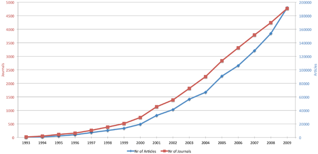
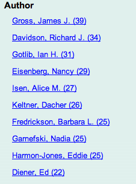
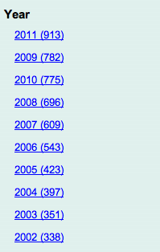
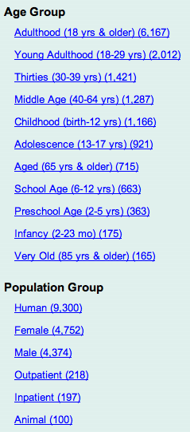
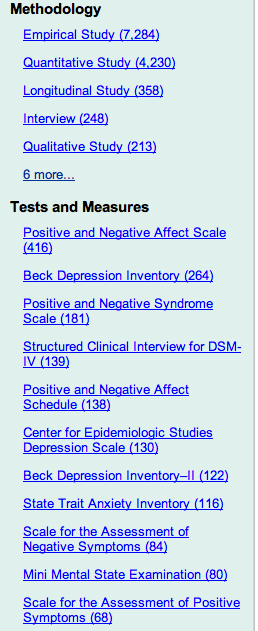

# 如何学习科学：开放科学工具箱

本文尝试谈谈对开放科学的理解以及整理部分参考线索。

- [前言：开放科学时代的到来](https://www.yangzhiping.com/psy/open-science-toolbox.html#q0)
- [Q1：理解科学](https://www.yangzhiping.com/psy/open-science-toolbox.html#q1)
- [Q2：开放科学是什么](https://www.yangzhiping.com/psy/open-science-toolbox.html#q2)
- [Q3: 如何获取高质量文献](https://www.yangzhiping.com/psy/open-science-toolbox.html#q3)
- [Q4: 如何高效管理文献](https://www.yangzhiping.com/psy/open-science-toolbox.html#q4)
- [Q5: 如何评价文献质量](https://www.yangzhiping.com/psy/open-science-toolbox.html#q5)
- [Q6: 如何获取并共享高质量数据](https://www.yangzhiping.com/psy/open-science-toolbox.html#q6)
- [Q7: 如何输出开放科学成果](https://www.yangzhiping.com/psy/open-science-toolbox.html#q7)
- [Q8：如何以开放学习的方式学习科学](https://www.yangzhiping.com/psy/open-science-toolbox.html#q8)
- [开放科学工具箱学科模版](https://www.yangzhiping.com/psy/open-science-toolbox.html#q10)

## 前言：开放科学时代的到来

作为普通人，你能想象：

- 你也能加入到[搜索外星人的行动](http://setilive.org/about)中去？
- 玩游戏，却是在[帮助科学家解决重大问题](http://fold.it/portal/)，成果发表在《[自然](http://www.nature.com/nature/journal/v466/n7307/full/nature09304.html)》这样的顶级刊物上？
- 你的微博随机散漫的情绪，却成为行为科学家建立模型，剖析人类情绪周期规律的来源？

作为研究者，你能想象:

- 索取论文不再受到学校图书馆IP地址的限制；
- 来自全世界的研究者按照某种规格[共同挑战数学难题](http://en.wikipedia.org/wiki/Polymath_Project)或者共享人格数据；
- 阅读文献的过程不再孤军奋战，可以清晰地了解到全世界同行在读什么文献。

随着人类族群整体步入集体智慧新时代之后，这一切来的速度比人们想象的更快。以下这张图是来自[SetiLive外星智慧搜索项目](http://setilive.org/about)的网站截图，截止今天，已经有5万多人边玩边加入搜索外星智慧的旅途。

如同TonyYet所写：[未来已经来临，只是还未惠及所有人](http://book.douban.com/review/5293458/)。类似于[Harold Varmus](http://www.cancer.gov/aboutnci/director)这样的[先行者们](http://www.plos.org/wp-content/uploads/2011/05/Signers-List-111610.pdf)开创潮流；[Michael Nielsen](http://en.wikipedia.org/wiki/Michael_Nielsen) 这样的分析者[发现、总结并放大趋势](http://en.wikipedia.org/wiki/Reinventing_Discovery:_The_New_Era_of_Networked_Science)；你呢？是假装山不在那里；还是加入进来，慢慢地来享受从山坡到巅峰的风景？

## Q1：理解科学

谈论开放科学，首先必须理解[科学](http://zh.wikipedia.org/zh/%E7%A7%91%E5%AD%A6)的本质。

### 模式战胜随机

在各种俗世纷争中，常有人逼你站队。在众人均信奉的神、传奇、公知与常识、科学之间。我的站队是，我是无神论者，无论人造的还是历史的，一律不相信。中国历史告诉我们，[儒家有士](http://www.yangzhiping.com/psy/qianmu.html)，但是帝国从来没有处在主流位置的公知。群而不党、批判性思维训练（真正的）与不贪财，这三点，哪些公知能做到十年如一日？在科学领域，神仅存在于那些终极问题之上，是唯一与俗世利益无关的神。放大时间周期来看，你容易发现因为利益结党；因为情绪盲从；因为贪财放弃自由思想的公知，但是，你能想象科学会这样吗？

按照欧洲社会心理学之父[莫斯科维奇](http://www.yangzhiping.com/psy/serge-moscovici.html)的观点，社会心理学就是一种关于常识世界、思想社会或者共识宇宙的科学。某种意义上，常识也是科学的一部分。问题得以简化，在神、传奇、公知与常识、科学这种对立之间，能被大时间周期证明的智者常选择科学。为什么？

从人类进化角度来说，选择理性、科学与逻辑，至少，你胜出的概率更大。因为它是用模式、概率、规律来战胜随机性。好的科学原理无不以遵从数学美原理为荣，它们从各个侧面，逼近人类大脑记忆本质，并深深铭刻在诸如书本这样的人类记忆共同体之内，得以被人们理解、运用并与随机化的世界沟通。

### 定义、验证与质疑

人们误解科学，常在于将实证看做其唯一，但它的本质是定义、验证与质疑。无论魔法世界还是修真世界，都存在一个基本准则：对事物进行定义并选取衡定标准，然后记录它，让实践碰撞它，最终促进新的诞生，这是真理之道。定义、验证与质疑，是为科学三部曲。

拿理性作为例子。反科学主义者常说人是非理性的，以此来贬低科学的价值。但科学的做法是，在理性的基础之上，又定义了[人类行为的“有限理性”](http://en.wikipedia.org/wiki/Bounded_rationality)，比如先后研究它们荣获诺贝尔奖的心理学家、管理学家、计算机科学家[西蒙](http://en.wikipedia.org/wiki/Herbert_Simon)与认知心理学家[卡尼曼](http://en.wikipedia.org/wiki/Daniel_Kahneman)，这就是科学的做法。

西蒙与卡尼曼开展或者实证或者非实证的研究，验证了一些想法，这些想法慢慢归结于精炼的，能被进化周期中，较笨的那部分人脑记忆的东西，启发人们的现实生活，变成一种莫斯科维奇所说的生活常识。定义是反驳对事物的不可知论，验证则反驳的是科学离现实太远的指责，也就是传统意义上的科学无用论。人们常常忘记的是，离现实很远的研究离进化周期并不一定远。

质疑则是科学最大的贡献，在现代科学范式之下，通过术语、公理、逻辑、文献引用、同行评审、写作格式约定等手段，建立了一个性价比较高的、容易沟通的知识良性循环体系。在这点上，反科学主义者的民主份子，却没有意识到，这种体系的平等与民主远胜于政治领域的效率。在Web2.0诞生之前，实际上，科学写作、文献引用、格式约定，已经建立了一种类似于Web2.0的集体智慧进化。内隐的人类智慧从此通过科学外行指责的八股文，得以问之于世，并在一个无关名利、地位的较公平平台上予以讨论。所以，我们能够很自然地看到借助于文献引用的规律诞生的Google，我们更能在复杂网络研究中，看到Google 的[PageRank算法](http://igraph.sourceforge.net/doc/R/page.rank.html)。今天这个时代，除了大自然的山川地理网络与人类自身的基因神经网络，为数不多的时间跨度达到百年以上，卷入人类达到千万级别的复杂网络，总是少不了文献引用网络。如果说书本代表了人类的记忆共同体，文献则代表了人类记忆中偏模式规律的那部分记忆。

## Q2: 开放科学是什么

为什么要谈论[“开放科学”(Open Science)](http://en.wikipedia.org/wiki/Open_science)？

### 科学的反科学

开放是动词，意味着存在着对科学的封闭动作，它们是哪些？如何阻碍了人类卓越智慧的诞生？开放是名词，同样意味着存在一种封闭的科学，它们有什么缺点？又是如何违背了科学的本质？为什么，在上个世纪，甚至更早年代，开放科学并不成为热门话题？

是这些，也不仅仅限于这些，在阻碍了科学的发展。

- 培养机制：年轻科学家培养周期日益漫长，做的课题不少离人们现实生活较远，也谈不上什么离进化周期近与创新；
- 供求机制：不是每个领域需要那么多科学家，在一些科学领域，博士、博后也开始成为廉价劳动力，部分老资格的科学家拥有极其丰盛的资源，霸占着位置却不干创新的活；
- 期刊垄断：几大垄断科技期刊集团，低成本获取到科学家的学术论文，反过来以高价卖给科学家所在机构；
- 科学普及：在科学与现实生活中，鸿沟日深。不少科学工作者离开自己狭小的专业领域，对现实生活失去科学精神的解释力，信奉星座等，拥有科学知识日益不等于拥有科学精神；
- 封闭数据：利用人类公共资源获取的数据却成为每个实验室的私有财富，数据仅报告显著性数据，那些，可能启发下一个大智慧的非显著性数据被扔进废纸篓；
- 美的丧失：人们对科学失去鉴赏力，普通大众甚至专业领域的研究者们也难以评价什么是美的、好的、有益的、容易跨越时空，流传百年，有益人类进化的科学作品。

### 开放科学的主要元素

基于以上不满，在早年学术协作与开放期刊发表传统之上，借助于互联网、开源软件传统，越来越多科学家加入[“开放科学”(Open Science)](http://en.wikipedia.org/wiki/Open_science)阵营，在科学知识的学习、传播、数据产生与获取、研究发表等诸多层面，采取了一些与传统不一样的做法，这股潮流，日益浩大，并成为运动。具体而言，每位“开放科学“理念或者运动的信奉者、参与者与领导者，坚持并发展其中的部分或者全部理念：

- 文献：以[开放获取](http://en.wikipedia.org/wiki/Open_access)期刊为荣，尝试逐步放弃不支持[开放获取](http://en.wikipedia.org/wiki/Open_access)的期刊，并相信同行的分享更胜于封闭的阅读；
- 数据：借助于互联网，通过众包的方式，开展大众参与进来的研究，获取真实地大样本数据，并主动将自己的数据以[开放数据协议](http://opendatacommons.org/)发布出来；
- 成果：除了在[开放获取](http://en.wikipedia.org/wiki/Open_access)期刊或传统学术期刊上发表论文之外，更抛弃传统专利等做法，采取更开放的[创新者专利协议](https://github.com/twitter/innovators-patent-agreement)、[开放数据协议](http://opendatacommons.org/)、[知识共享协议](http://creativecommons.net.cn/)，在研究过程中，广泛借助于开源软件，并开发各类开源软件，发布出去，让大众参与进来。
- 传播：让科学与大众更近，并踊跃参与各类[开放性课程](http://zh.wikipedia.org/zh/%E9%96%8B%E6%94%BE%E5%BC%8F%E8%AA%B2%E7%A8%8B%E7%B6%B2%E9%A0%81)、 [开放性学习](http://openstudy.com/)。

## Q3: 如何获取高质量文献

### 如何免费获取期刊全文：开放获取期刊

目前，学术期刊出版方式逐步发生变革。[开放获取期刊 (Open Access，简称OA)](http://en.wikipedia.org/wiki/Open_access)开始流行。什么是[开放获取期刊 (Open Access，简称OA)](http://en.wikipedia.org/wiki/Open_access)？它仍然坚持了学术期刊的同行评审原则，但是所有文章均能免费获取全文。

近些年，开放获取期刊增长速度极快，并且已经增加了不少高引用、高质量的刊物：

截止今天，开放获取期刊门户网站DOAJ网站已经收录大量期刊，美国以1360本刊物位居第一，大陆以33本刊物[排在42位](http://www.doaj.org/doaj?func=byCountry&uiLanguage=en)。

以下为开放获取期刊重要链接：

- [DOAJ网站](http://www.doaj.org/)收集了所有学科，支持OA的期刊。部分期刊还可免费发布论文。在我关注的心理学领域已有[157本期刊](http://www.doaj.org/doaj?func=subject&cpid=128&uiLanguage=en)。
- [PLoS](http://plos.org/)：已多次推荐。与心理学相关的主要是物理学尤其是复杂网络、计算机科学中的有关研究。
- [frontiersin](http://www.frontiersin.org/about/journalseries)：含神经、认知、心理学等。
- [Hindawi](http://www.hindawi.com/): 为数不多的，以开放获取期刊出版为业务的商业期刊出版机构。
- [认知科学与神经科学主要开放获取期刊列表](http://www.cogsci.nl/open-access-journals)

同样，部分国内期刊与研究机构也支持开放获取，并整理了相应目录：

- [开放存取图书馆](http://www.oalib.com/)
- [开放获取期刊列表](http://zh.wikipedia.org/zh/%E9%96%8B%E6%94%BE%E7%8D%B2%E5%8F%96%E6%9C%9F%E5%88%8A%E5%88%97%E8%A1%A8)
- [中科院开放获取期刊](http://www.oaj.cas.cn/cn/default.aspx)
- [中科院国家科学图书馆开放获取信息门户](http://www.open-access.net.cn/5f00653e83b753d68d446e90/5f00653e83b753d6671f520a95e86237)
- [开放获取期刊目录](http://www.socolar.com/)：一如既往地中国特色，既然开放获取了，还非要搞个验证码。

### 高质量文献源

除了开放获取期刊提供的文献源之外，同样，还存在大量高质量文献源。例如：[BibDesk](http://bibdesk.sourceforge.net/)内置的文献数据源质量都不错，它们分别是：

- [Google Scholar](http://scholar.google.com/)
- [ACM](http://dl.acm.org/)
- [CiteULike](http://www.citeulike.org/)
- [HubMed](http://www.hubmed.org/)
- [INSPIRE](http://inspirebeta.net/)
- [arXiv](http://arxiv.org/)：开放获取期刊的先行者，论文侧重物理、数学与计算机领域。
- [IACR (Cryptology)](http://eprint.iacr.org/)
- [MAS](http://academic.research.microsoft.com/)：微软学术搜索。

首选为Google Scholar。记得在[Google学术偏好设置](http://scholar.google.com/scholar_preferences)中，修改文献导出格式，比如Endnote格式，如下图所示：

那么，就会在你的Google学术检索结果多出一条导出链接。以social network analysis 作为关键词，检索2010年以来的论文，结果如下图所示：

我们会发现，社会网络分析领域，2010年以来，Pajek这本书引用率较高，然后在豆瓣中，搜索，又可以发现一个开放科学的典型例子，一位非网络分析领域的医学研究者已经[自发翻译了这本书](http://book.douban.com/review/1528109/)，并即将在今年年中出版。

作为参考文献引用，直接点击“Import into EndNote”并导入即可。如果经常性导入文献较多，还可以借助于浏览器脚本等撰写自动化脚本。

除了以上文献源之外，还可以在BibDesk内置的商业订阅文献库、Endnote的在线商业数据库找到你所在领域的研究数据库。在心理学领域，本人常使用以下2个商业文献数据库：

- [APA的Psycinfo数据库](http://psycinfo.com/)
- [MIT的cognet认知数据库](http://cognet.mit.edu/)

### 学术会议、讲义、基金等共享网站

- [videolectures](http://videolectures.net/)：众多高质量，包括诺奖得主参与的学术会议视频、ppt合集。
- [iamresearcher](http://www.iamresearcher.com/)：你可以将它理解为一个基于学术文献、学术会议的SNS。
- [researchgate](http://www.researchgate.net/)：科学家社交网站。
- [conferencealerts](http://www.conferencealerts.com/psychology.htm)：学术会议订阅。
- [slideside](https://www.yangzhiping.com/psy/slideshare.net/)：老牌，还要介绍吗？我的多数可以公开的ppt都放在这里。
- [COS](http://fundingopps.cos.com/about/fundingopps.shtml)：超过33亿美元的基金申请记录查询与跟踪。
- [engrant](http://search.engrant.com/Search.aspx):另一个科研基金搜索网站。
- [medsci](http://www.medsci.cn/sci/index.asp?action=search):sci投稿查询。

## Q4: 如何高效管理文献

### #新兴文献管理软件与共享网站

借助于Web2.0技术，部分年轻科学家开始广泛参与到各类Web2.0文献协作网站，分享读过的文献：

- 支持部分全文下载，以参考文献为核心，研究者相互协作的[mendeley](http://mendeley.com/)。
- [citeulike](http://www.citeulike.org/)：它是LaTex配套的文献管理软件，当然，也可独立使用的[BibDesk](http://bibdesk.sourceforge.net/)内置的文献管理网站之一。
- [Zotero](http://www.zotero.org/)：以浏览器为基础的文献管理工具，目前已经支持chrome、firefox等多个浏览器。当你在各大文献数据库，读到好文献的时候，轻轻一按浏览器按钮，它就自动分析格式并保存在线数据库中。

以上三个网站，都是有相应配套文献管理软件的，并且天然以互联网为基础，支持Web2.0性质的文献共享、文献自动发现。

### #老牌文献管理软件

提到文献管理软件，不得不提到老牌的[EndNote](http://www.endnote.com/)与老友创业团队开发的、国内市场占有率名列前茅的[NoteExpress](http://www.scinote.com/)。国内外不少研究者仍然使用这类老牌文献管理软件，如何共享文献？

在[EndNote](http://www.endnote.com/) 中，一个较好的习惯是，写完论文之后，借助于它的**Export Traveling Library**功能，将每篇论文的参考文献导出为一个新的Endnote文献管理库，如下图所示：

然后将该文件，共享给有关同事或者课题组成员，或者直接放在互联网上提供下载。与配套论文，尤其是文献综述、博士论文、经典文献共同阅读，非常容易了解该具体课题领域的研究进展，并通过在[EndNote](http://www.endnote.com/) 对文献的年份、期刊、作者的排序与进一步检索，发现一些更本质的规律。

遗憾的是，老友的[NoteExpress](http://www.scinote.com/)很容易做到不是论文层级而是整个数据库层级的共享，但目前没有针对每篇论文，自动汇集这篇论文中的参考文献，并可将其导出为新数据库的功能。

## Q5:如何评价文献质量

### 如何拜对庙？

科学理论的繁复与传播体系的利益导向，在学习科学时，容易入错门，拜错庙。真传一篇论文即可，却常被忽悠十年甚至一辈子。朝问道，道在哪里？道在定义、验证与质疑的科学三部曲之中。请格外注意：

- 好的庙除了香火旺盛与学术大神之外，更具备一个重要特质：学徒们独立开宗立派，而不是依赖它吃饭，因为强迫学徒掌握某学问与掌握科学精神的大神是两类，让你以他为师与以模式、规律为师的也是两类。
- 哲学、文化并不重要。在现代科学体系之中，较烦某些人的废话，什么哲学，什么中国文化，什么易经。一旦看到哪个西方著名心理学家号称对中国文化喜爱，就上赶着来宣传。哲学、中国文化是很博大精深，但是现状是中国科学发展远远落后于西方，错了就是错了，落后了就是落后了。中国文化那是人家的开胃小菜，你却当着终身志业来吹。

读诺奖得主狄拉克传纪，抄送一段给大家：哲学不会对物理学做出任何重要贡献。狄拉克在认识哲学43年之后，仍然这么写道：我认为哲学不会导致重要发现，它只是人们谈论已知事物的一种方式而已。那么，狄拉克如何形成自己的方法论？四个重要观点：1）工具主义和可观察原则；2）自然界的统一；3）充实性原理；4）数学美原理。尤其是数学美。

如何拜对庙？一流期刊科学家的文献引用率、民众普遍关心的问题、高创意与广泛使用的开源项目。总有一个是自己感兴趣的。 以下以文献引用率为例进行说明。

### 评价文献质量的方法

评价文献引用率与科学家质量，一般来说，可以借助于以下指标来评价：

- ESI（Essential Science Indicators）
- JCR（Journal Citation Report）
- [H指数（h-factor）](http://zh.wikipedia.org/zh/H%E6%8C%87%E6%95%B0)：这里是世界上最牛的[计算机科学家列表](http://www.cs.ucla.edu/~palsberg/h-number.html)。
- [Google Scholar](http://scholar.google.com/)的引用率
- [微软学术搜索](http://academic.research.microsoft.com/)的评价工具
- [highlycited.](http://highlycited.com/categories/psychology_psychiatry/)
- [期刊排名](http://www.scimagojr.com/journalrank.php?area=3200&category=0&country=all&year=2011&order=h&min=0&min_type=cd)

### 有新进展的研究主题与热点论文

以下以ESI为例。[sciencewatch](http://sciencewatch.com/)网站是在ESI等经典数据库基础上整合而来，提供了很多特色栏目与资讯。一些值得去拜的山头如下：

### #专题

它的[Special Topics栏目](http://sciencewatch.com/ana/st/about/)，提供了[2001年7月到现在的特选专题](http://sciencewatch.com/ana/st/alltopics/)。这些研究课题往往是很值得关注的，其中，与心理学有关系的是：

- 2011年3月：[阿尔茨海默氏病（第二次上榜)](http://sciencewatch.com/ana/st/alz2/)
- 2009年4月：[人脸识别](http://sciencewatch.com/ana/st/face/)
	 2007年12月	：[人工神经网络](http://www.esi-topics.com/art-neu-net/)
- 2007年10月：[精神分裂症（第二次上榜)](http://www.esi-topics.com/sch2007/index.html)
- 2005年10月：[恐怖主义](http://www.esi-topics.com/terrorism/index.html)
- 2005年7月：[注意力缺失症与注意力缺失多动症](http://www.esi-topics.com/add/index.html)
- 2004年6月：[创伤后应激障碍](http://www.esi-topics.com/ptsd/index.html)
- 2004年2月：[自闭症](http://sciencewatch.com/sciencewatch/ana/st/_vti_cnf)
- 2003年4月：[阿尔茨海默氏病](http://www.esi-topics.com/alzheimer/index.html)
- 2001年7月：[精神分裂症](http://www.esi-topics.com/schizophrenia/index.html)

### #热点论文

它的[Hot Papers](http://sciencewatch.com/dr/nhp/)，提供了22个领域的被引用次数为各个领域前0.1%的论文。[Fast Breaking Papers](http://sciencewatch.com/dr/fbp/)则提供了22个领域的被引用次数前1%的论文。

以上资讯均可免费获取，进一步，如果订阅了有关商业数据库，可以获得更详细地，关于本研究领域的平均引用率、top科学家等。同样可以更轻松的方式获取有关资讯。例如，这是近三年心理学与精神病学领域的[突破进展论文](http://sciencewatch.com/dr/fbp/)：

### ##2011年

- 2011年2月：LONG-CHAIN OMEGA-3 FATTY ACIDS FOR INDICATED PREVENTION OF PSYCHOTIC DISORDERS A RANDOMIZED, PLACEBO-CONTROLLED TRIAL，[作者访谈](http://sciencewatch.com/dr/fbp/2011/11febfbp/11febfbpAmmi/).
- 2011年4月： Prediction of Psychosis in Adolescents and Young Adults at High Risk Results From the Prospective European Prediction of Psychosis Study
- 2011年6月：Visual stability based on remapping of attention pointers
- 2011年8月： Stress Hormone Regulation: Biological Role and Translation into Therapy
- 2011年10月：Treatment and prevention Past, present, and future
- 2011年12月：A gradient of childhood self-control predicts health, wealth, and public safety

### ##2010年

- 2010年2月：Predictors of Spontaneous and Systematically Assessed Suicidal Adverse Events in the Treatment of SSRI-Resistant Depression in Adolescents (TORDIA) Study
- 2010年4月：Associations of Depression With C-Reactive Protein, IL-1, and IL-6: A Meta-Analysis
- 2010年6月：Attention Modification Program in Individuals With Generalized Anxiety Disorder
- 2010年8月：Understanding and Using the Implicit Association Test: III. Meta-Analysis of Predictive Validity **值得关注**
- 2010年10月：The Dopamine Hypothesis of Schizophrenia: Version III-025EF—The Final Common Pathway，[作者访谈](http://sciencewatch.com/dr/fbp/2010/10octfbp/10octfbpKapu/)
- 2010年12月：Endocrine Regulation of Cognition and Neuroplasticity: Our Pursuit to Unveil the Complex Interaction Between Hormones, the Brain, and Behaviour

### ##2009年

- 2009年2月：Individual differences in the regulation of intergroup bias: The role of conflict monitoring and neural signals for control **值得关注**
- 2009年4月： Prediction of psychosis in youth at high clinical risk
- 2009年6月： Grounded cognition，[作者访谈](http://sciencewatch.com/dr/fbp/2009/09junfbp/09junfbpBars/) **值得关注**
- 2009年8月：A Review of Behavioral Treatments for Self-Injurious Behaviors of Persons With Autism Spectrum Disorders
- 2009年10月：Who keeps children alive? A review of the effects of kin on child survival
- 2009年12月：Elevated Striatal Dopamine Function Linked to Prodromal Signs of Schizophrenia [作者访谈](http://sciencewatch.com/dr/fbp/2009/09decfbp/09decfbpHowe/)

### PsycInfo检索示范

对于作者所在的心理学领域来说，还有更简单的办法来评价文献质量。以下以APA的PsycInfo数据库为例，当你检索关键词，有关研究会自动按照研究方法、研究人口学信息、作者及其在这个领域的发表论文的数量等列出来，那些在某个特定领域发表论文数量较多，同时发表的又总是类似于JPSP等权威期刊的研究者往往是值得关注的。以我组织翻译过的图书[《积极情绪的力量》](http://www.yangzhiping.com/psy/positivity.html)为例，我们检索积极情绪（Positive emotion），结果如下，

### #作者

我们会发现，该书作者芭芭拉(Fredrickson,Barbara L.)显然是这个领域的权威，论文数量在25篇左右。而积极心理学的其他权威迪纳（Diener）等人显然也经常客串该领域。

### #研究年份

积极情绪领域，每年发表的论文都在增加，是一个值得研究者追加投入的领域。但是，如何判断巅峰来临，你进入这个领域是做炮灰呢？一般而言，对于开放科学爱好者的建议是，听从你的内心。你如果喜欢积极情绪领域，就较少考虑该问题。但是如果该领域持续十年是一潭死水，那么，可能，开放科学爱好者要挑起这个领域的大梁，难度过大。

### #研究对象

现有积极情绪研究集中的地方，主要是在成年人身上，这既可能是研究概念特质导致的，也可能是陷阱。某些研究领域，如果切换到动物身上或者其他年龄组身上，会获得更重大的发现。

### #研究方法

研究者普遍使用的研究方法是实证研究方法（7284篇研究），主要的量表是积极和消极情感量表（416篇研究）。为了在国际期刊发论文，减少与同行沟通的歧义，显然，也可考虑使用争议较少的量表。

我的事业领域侧重心理学领域，以上为PsycInfo的示例。同样，在你所感兴趣的学术领域，可以参考前文，也存在大量类似高质量的信息源，将让你节省时间，直接追问一手卓越智慧。

需要提醒的是，如果你是专业研究者，所在机构购买了Web of Knowledge等商业数据库，你还可以采用文献分析软件，例如[hist cite](http://thomsonreuters.com/products_services/science/science_products/a-z/histcite/)与[citespace](http://cluster.cis.drexel.edu/~cchen/citespace/)直接获得深度分析结果或者导入文献数据之后进行网络分析。

## Q6：如何获取并共享高质量数据

### 在线实验与协作获取数据

可以自己设计实验获取数据，部分实验可以在线进行，这是开放科学领域一些著名的大众参与的实验与数据共享计划：

- [脑图计划](http://www.brain-map.org/)：在这篇[采访](http://online.wsj.com/article/SB10001424052970204630904577058162033028028.html)中，艾伦脑科学研究所的人谈到了初衷。
- [鸟类观察计划](http://ebird.org/)
- [个人基因组计划](http://biomedcentral.com/)
- [星系动物园计划](http://www.galaxyzoo.org/)：它是[zooniverse](https://www.zooniverse.org/)公民科学计划的一部分，在上面，你还可以发现更多有趣、有益的项目。

无论仰望星空，还是丛林鸟影，开放科学的力量日益强大。

心理学领域的，进行在线实验与集体协作，可以参考：

- [在线心理学实验](http://www.onlinepsychresearch.co.uk/)
- [在线社会心理学研究](http://www.socialpsychology.org/expts.htm)
- APA近些年出版的图书，[Advanced Methods for Conducting Online Behavioral Research](http://www.apa.org/pubs/books/4311014.aspx)

### 使用第三方数据源

[开放科学数据](http://en.wikipedia.org/wiki/Open_science_data)已成为开放科学共识与重要元素之一。一些重要的第三方数据源：

- [figshare](http://figshare.com/)
- [30个免费数据资源网站](http://xccds1977.blogspot.com/2012/04/30.html)：一位R中文博客作者恰巧也于近期总结了一些数据源.
- [openscienceframework](http://openscienceframework.org/)：一个近期发布，帮助人们更好利用实验室数据的计划。
- [psychfiledrawer](http://psychfiledrawer.org/):侧重心理学实验。

我所关注的社会网络分析领域的数据，则主要在：

- [SNAP](http://snap.stanford.edu/data/)：囊括社会网络、通信网络等多个领域的数据。
- [INSNA](http://www.insna.org/software/data.html)：社会网络分析国际学会提供的数据源。

### 数据共享法律协议

- [创新者专利协议](https://github.com/twitter/innovators-patent-agreement)
- [开放数据协议](http://opendatacommons.org/)
- [知识共享协议](http://creativecommons.net.cn/)

以上协议，为开放科学爱好者共享数据或者研究成果，提供了法律参考范本。

## Q7：如何输出开放科学成果

干货、成品重于一切。什么是干货？论文、开源项目、公司，甚至一次社区活动。有时候，基于学习开放科学的成果，塑造一个成品，没有你想象的那么难。有时候，一个非phd甚至一个高中生，发一篇国际一流期刊论文，也没你想的那么难。你所需要的，是大时间周期的刻意练习而已。在这里，开放科学界的先锋们广泛认同开源界的理念：[尽快发布、经常发布](http://en.wikipedia.org/wiki/Release_early,_release_often)。我们在这里，可以看到更多开放科学的成功故事，例如，拿过英国心理学会年度大奖的同行[这样玩开放科学](http://www.oastories.org/2011/09/uk-researcher-professor-emily-holmes-tetris-paper-plos-one/)。如果你对开放科学没信心，oastories这个网站的成功故事就是专门拿来给你打鸡血的:D

### 写作

民科与有科学训练或者素养的人的差异在于参考文献与思维模式。民科的观点多数是自己的，变量是自己定义的，无从讨论，偶尔竖起的靶子也早已是学界放弃的稻草人议题。科技写作、论文写作，应是开放科学爱好者必经的一个训练历程。作者在[技术派心理学](http://book.douban.com/doulist/1222833/)豆列整理了大量关于科技写作、论文写作的参考图书，可以参考。

一般来说，如果你是侧重人文社会科学等领域，使用APA第6版或者第5版格式即可。中文图书可以参考：[美国心理协会写作手册](http://book.douban.com/subject/2984773/)。如果希望了解到更多非APA格式的写作格式，则可以参考：[诚实做学问](http://book.douban.com/subject/1943106/)。

对于在非windows下基于LaTex撰写，基于APA格式的论文或者科技文章，有一些重要参考资源与线索：

- mac使用LaTex：推荐[MacTex](http://www.tug.org/mactex/2011/)：文件超大，但是一键式安装，各种工具已经齐全。
- APA第6版写作格式的配套包：推荐[APA6](http://www.ctan.org/pkg/apa6)，与LaTex的绝配。

本人更倾向于使用Markdown写作：

- [Pandoc](http://johnmacfarlane.net/pandoc/)：转换各类格式利器，支持Markdown与LaTex的互转，更支持十来种格式的互转。
- [knitr](http://yihui.name/knitr/)：yihui大作。

### 开源项目

[Github](http://github.com/)，你唯一需要的。

### 社区活动

国内的，我们可以看看：

- [猫头鹰实验室](http://maotouying.net/)

以及各类创客活动。

## Q8：如何以开放学习的方式学习科学

科学不属于学院，更不属于政治党派与媒体集团，而仅仅属于好奇心、创造力。你定义了，就去实践；你读到了，就去质疑。它本就应该是开放的:D

[开放性课程](http://zh.wikipedia.org/zh/%E9%96%8B%E6%94%BE%E5%BC%8F%E8%AA%B2%E7%A8%8B%E7%B6%B2%E9%A0%81)、 [开放性学习](http://openstudy.com/)是与开放科学紧密相关的概念。开放学习者既是开放科学的后备军，也是它的重要推手。在[不上大学，你可以学些什么](http://www.yangzhiping.com/psy/open-classroom.html)中，作者已经介绍过一些开放学习的资源：

- [TED](http://www.ted.com/)：尖峰创想，启迪心智
- [斯坦福开放大学](http://itunes.stanford.edu/)：免费读大学，最新的类似于IOS开发与Ruby开发系列课程，你可以免费找到
- [MIT开放课程](http://ocw.mit.edu/courses/)：世界上最好的理工学院，关于人工智能等议题开启你的好奇心
- [YouTube](http://www.youtube.com/):大量的学习视频都集中在这里
- [stackexchange](http://stackexchange.com/sites)：全世界的热心人士都集中在这里提问与回答问题
- [edge](http://edge.org/)：牛人与牛人对话

中文汉化：

- [TEDtochina](http://tedtochina.com/)：TED中文社区，不仅仅是翻译。
- [网易公开课](http://open.163.com/)：有TED及各个国外大学的开放课程的翻译。
- [MyOOPS开放课程](http://www.myoops.org/main.php)：来自全球顶尖大学的开放式课程，现在由世界各国的数千名义工志工为您翻译成中文。

除了TED、公开课这些大家日益熟悉的开放学习资源之外，还有一些国内不太熟悉的开放学习资源：

- [openstudy](http://openstudy.com/)：创新的在线学习方式，新推出的积分方式更切合学习科学原理。
- [videolectures](http://videolectures.net/)：众多高质量，包括诺奖得主参与的学术会议视频、ppt合集。也不仅仅是学术会议。包括众多高质量课程。遗憾的是，网站本身对Html5等支持较差，难以通过ios等设备查看。
- [coursera](https://www.coursera.org/)：名校课程汇集，近期拿到1600万投资，已有190个国家16万学生汇集。
- [可汗学院](http://en.wikipedia.org/wiki/Khan_Academy)：这个还有必要介绍吗？
- [openhatch](http://openhatch.org/): 通过练习、任务等帮助新手更好地进入开源社区
- 来自TonyYet整理的部分[在线教育视频资源](http://www.douban.com/group/topic/5853829/)
- [coursehero](http://www.coursehero.com/)：全方位的课程列表，对课程的整理。

当然，在这里，仍然少不了，给心理学做个广告:D

- [美国心理协会（APA）的在线心理学实验室](http://opl.apa.org/)：用简单互动的方式让你理解心理科学，初中以上水平即可读懂。
- [美国心理协会（APA）的用多种语言理解偏见项目](http://www.understandingprejudice.org/apa/chinesesimp/)：走向民主的路上，相互少点偏见，多点批判性思维:D

## 结束语

前些日子，与老友聊天，工作四年的青椒。我问了一个问题：

> 越来越多的非专业领域的研究者，在信息输入上，听着videolectures、TED，上着MIT、斯坦福网上公开课，平时看的是MIT的cognet认知数据库，APA的Psycinfo数据库等高质量数据库，泡的是github、Stackexchange、Hacker News这些开源社区。在信息输出上，投递的是DOAJ开放获取或同行评审意见很直接的英文期刊，创作的是直接在Apple Store、Facebook销售的app。

> 你的原始做法如何跟他们拼？

更恐怖的是，以上所有资源都是对全世界开放的。开源爱好者或者开放科学爱好者一上来就是介入一个世界级别的智慧成长体系之中。开放科学爱好者本着最初的好奇心探索人类智慧巅峰，边玩边创作。随着开源世界、开放科学领域的各类复用模式的快速迭代与进化，我们难道不能相信，未来的某一天，世界级的成果将在开源软件、开源硬件、开放科学这样的领域诞生？

未来已经悄悄来临，只是还未惠及所有人，希望老友这样的青椒，你我这样的开放科学爱好者，慢慢地，自己受益的同时，也让更多人受益。

## 开放科学工具箱学科模版

以上例子，更多以心理学为例。如果你是其他学科，欢迎使用[开放科学工具箱学科模版库](http://www.yangzhiping.com/openscience/)，从自己所在学科领域整理，更欢迎提交给我。有些体力活，会终生受益。

## 相关参考

- [不上大学，你可以学些什么](http://www.yangzhiping.com/psy/open-classroom.html)
- [如何高效利用github](http://www.yangzhiping.com/tech/github.html)
- [如何提高文章含金量？](http://www.yangzhiping.com/psy/think-density.html)
- [成为创作者](http://www.douban.com/group/topic/28367173/)